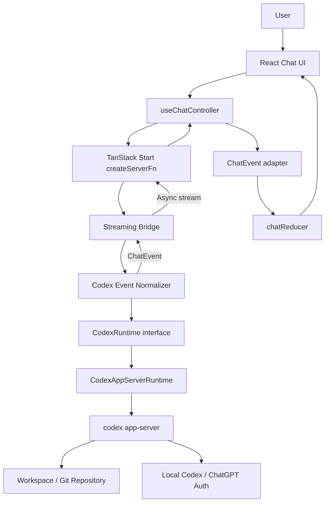
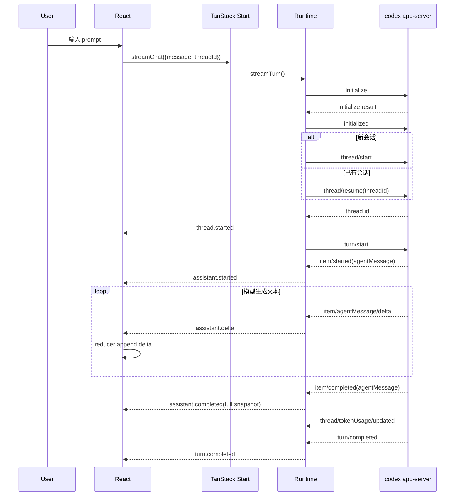

# Codex + TanStack Start：系统架构学习笔记

> 目标：这不是项目进度记录，而是一篇可以脱离当前上下文独立复习的架构笔记。它回答三个问题：**系统边界在哪里、数据如何流动、为什么要这样分层。**

## 1. 问题背景：我们真正要解决什么

这个项目不是在“做一个聊天框”，而是在验证一套本地 Agent Web 架构：浏览器负责交互，TanStack Start 负责 Web/RPC 边界，Codex app-server 负责 Agent runtime，本机已有的 Codex/ChatGPT 登录态负责认证。

核心约束有四个：

1. 浏览器不能拿到 Codex 凭据、`~/.codex`、原始协议对象或本地敏感信息。
2. Agent 回复必须是真正的流式文本，而不是请求完成后一次性返回。
3. Web 层不能直接绑定 Codex 协议，否则以后换 Claude、Pi、Qwen 或其他 runtime 会牵动整个 UI。
4. V0 必须保持只读：可以分析仓库，但不允许文件写入、网络访问或交互式审批绕过。

因此，架构目标不是“最少代码”，而是建立几个清晰的边界：

```text
Browser/UI boundary
Transport/RPC boundary
Application event boundary
Agent runtime boundary
Local machine / workspace boundary
```

真正重要的是：每一层只理解自己需要理解的协议。

---

## 2. 总体架构



从浏览器看，它只知道：

```text
ChatRequest -> stream<ChatEvent>
```

它不知道：

```text
JSON-RPC
codex app-server
thread/start
turn/start
item/agentMessage/delta
~/.codex
子进程
stdio
```

这就是架构中的第一原则：**把基础设施协议封装成应用协议。**

---

## 3. 三层系统边界

### 3.1 Browser：只负责产品状态

浏览器职责：

- 收集用户输入；
- 调用 `streamChat()`；
- 消费 `ChatEvent`；
- 维护消息、运行状态、活动状态；
- 保存最小会话信息；
- 渲染 UI。

浏览器不应该：

- 调用 `codex app-server`；
- 读取 Codex 登录文件；
- 接触 MCP 参数/result；
- 接触 command stdout/stderr；
- 接触 reasoning 原文；
- 决定 sandbox 权限。

**前端状态不是 Agent runtime 状态。** 前端保存的是“产品需要展示的投影”。

### 3.2 TanStack Start Server：安全网关 + 协议翻译层

Server 层做三类工作：

1. 输入验证；
2. runtime 调用；
3. 将 runtime 事件变成浏览器安全的应用事件。

`src/server-functions/chat.ts` 很关键，因为它是浏览器可导入模块，但真正的 Codex runtime 被隔离在 `*.server.ts` 后面。

```text
client import
   |
   v
createServerFn()
   |
   | server execution only
   v
chat.runtime.server.ts
   |
   v
Codex runtime
```

这解决了一个典型全栈框架问题：**同一个 TypeScript 工程不等于所有模块都可以进入 browser bundle。**

### 3.3 Codex Runtime：负责 Agent 生命周期

Runtime 层负责：

- spawn `codex app-server --stdio`；
- initialize；
- start/resume thread；
- start turn；
- 接收 item notification；
- 接收 assistant delta；
- 收集 usage；
- 清理进程；
- 把协议对象转换为内部 `CodexThreadEvent`。

这里最重要的架构点不是 Codex，而是 `CodexRuntime` interface。

```ts
interface CodexRuntime {
  streamTurn(input: StreamCodexTurnInput): AsyncGenerator<CodexThreadEvent>
}
```

UI 不依赖 `CodexAppServerRuntime`，server function 也不应该依赖 JSON-RPC 细节。

---

## 4. thread / turn / item：必须建立的心智模型

这是理解 Codex Agent runtime 的基础。

### Thread

`thread` 是长期会话上下文。

它类似：

```text
Conversation / Agent Session
```

第一条消息：

```text
thread/start
```

后续继续聊天：

```text
thread/resume(threadId)
```

浏览器 localStorage 保存 `threadId` 的原因，就是要把产品侧会话重新连接到 Codex 侧的长期上下文。

### Turn

`turn` 是 thread 中一次用户输入对应的一轮 Agent 工作。

```text
Thread
├── Turn 1
├── Turn 2
└── Turn 3
```

一次 turn 可能包含：

- reasoning；
- command execution；
- MCP tool call；
- web search；
- assistant message；
- token usage；
- error。

因此：

> 一个 HTTP/RPC 请求不等于一个 assistant message，而更接近一个完整 turn。

### Item

`item` 是 turn 内部的工作单元。

```text
Turn
├── reasoning item
├── command item
├── tool item
└── agentMessage item
```

Assistant 文本本身也是一个 item，它有生命周期：

```text
item/started
    ↓
item/agentMessage/delta × N
    ↓
item/completed
```

这也是为什么 UI 应使用：

```text
assistant.started
assistant.delta
assistant.completed
```

而不是只使用一个：

```text
assistant.message
```

---

## 5. 一条消息的完整生命周期



这里有两个特别值得记住的设计：

### Delta 用于体验

`assistant.delta` 提供实时输出。

### Completed snapshot 用于校准

最终 `item/completed` 里的完整文本不是多余的。

它可以校准：

- delta 丢失；
- delta 重复；
- snapshot 修订；
- 中间状态异常。

设计原则：

```text
delta = 实时体验
completed snapshot = 最终事实
```

---

## 6. 为什么需要 application-owned `ChatEvent`

这是整个架构最值得迁移到其他项目的设计之一。

如果 UI 直接消费 Codex：

```ts
if (event.method === 'item/agentMessage/delta') { ... }
```

那么 UI 已经被 Codex 协议绑死。

现在使用：

```ts
ChatEvent =
  | assistant.started
  | assistant.delta
  | assistant.completed
  | activity.started
  | activity.updated
  | activity.completed
  | turn.completed
  | error
```

于是关系变成：

```text
Codex protocol
      ↓ adapter
Application protocol
      ↓
React UI
```

未来换 runtime：

```text
Claude events ─┐
Pi events      ├─> ChatEvent ─> UI
Qwen events   ─┘
```

UI 不变。

### `ChatEvent` 不是简单 DTO

它承担三个职责：

1. **解耦**：隔离供应商协议；
2. **安全**：只允许白名单数据进入浏览器；
3. **产品语义**：把 Agent 底层事件转换成 UI 真正关心的生命周期。

这比“直接透传原始 event，然后前端自己判断”健壮得多。

---

## 7. 为什么还要有 `ChatStateEvent`

项目里实际上有两个事件层：

```text
ChatEvent        -> transport contract
ChatStateEvent   -> reducer contract
```

它们不是重复设计。

例如 server 只需要告诉浏览器：

```text
assistant.started(id)
```

而 reducer 创建消息时需要：

```text
createdAt
```

于是 adapter 可以在客户端补产品状态需要的信息：

```text
ChatEvent
  ↓ toChatStateEvent(receivedAt)
ChatStateEvent
  ↓
Reducer
```

这遵循一个很重要的原则：

> Transport model、domain model、view state model 不应因为字段看起来相似就强行合并。

---

## 8. Server-only 边界为什么重要

全栈 TypeScript 很容易制造一种错觉：

> “既然都是 TS 文件，直接 import 不就行了吗？”

问题是 browser bundle 一旦导入 runtime 模块，就可能把：

- Node API；
- 本地路径；
- 子进程逻辑；
- 协议类型；
- 甚至认证相关实现

带进浏览器构建图。

当前项目的边界是：

```text
chat.ts                    browser-importable RPC declaration
chat.runtime.server.ts     server-only seam
src/server/codex/**        server-only runtime
```

`createServerFn` 的价值之一，就是让客户端引用一个“函数形状”，实际执行发生在服务器。

---

## 9. 持久化边界：谁保存什么

当前有两套状态所有者。

### Browser 持久化

只保存：

```text
threadId
messages[]
```

这解决的是产品体验：刷新页面后仍然能看到聊天记录并继续原线程。

### Codex 持久化

Codex 自己维护 thread/session 数据，例如本地 session。

这解决的是 Agent 上下文。

两者不能混为一谈：

```text
Browser transcript ≠ Codex thread state
```

浏览器消息只是 UI 投影，不应该被当成 Agent 的唯一真实上下文。

### New Chat 的语义

当前 New Chat 做的是：

```text
清浏览器 active conversation
```

不是：

```text
删除 Codex 历史 session
```

这是正确的职责分离。

---

## 10. V0 read-only 安全模型

当前策略：

```text
model: luna
effort: high
sandbox: read-only
sandboxPolicy.networkAccess: false
approvalPolicy: never
```

安全思路不是依赖一个开关，而是多层防线。

### 第一层：权限限制

```text
read-only sandbox
network disabled
```

### 第二层：无交互审批

```text
approvalPolicy: never
```

避免 runtime 临时要求更高权限后由 Web UI 放行。

### 第三层：数据最小化

浏览器不接收：

```text
reasoning raw text
command stdout/stderr
MCP arguments/results
auth data
raw runtime event
```

### 第四层：workspace root

工作目录需要 canonicalize，并限制在允许 root 下。

安全原则：

> Agent 的权限控制和 UI 的数据脱敏是两个不同问题，二者都必须做。

只读 sandbox 防止 Agent 修改系统；事件白名单防止敏感信息泄漏到 Browser。

---

## 11. 为什么不直接把 Codex 协议给前端

看起来直接转发 JSON-RPC 最省代码：

```text
Codex -> WebSocket -> Browser
```

但会带来几个长期问题。

| 方案 | 优点 | 代价 |
|---|---|---|
| 原始协议直传 | 开发快、信息完整 | 前端强耦合 Codex、敏感字段难控制、协议升级影响 UI |
| Server normalize | 安全边界清楚、UI 稳定、可换 runtime | server adapter 代码更多 |
| Browser 自己 adapter | server 简单 | 安全与兼容逻辑散落前端，不推荐 |

对于 Agent 产品，推荐：

```text
Raw runtime protocol
        ↓
Server-side normalization
        ↓
Stable app protocol
```

因为 runtime event 通常比 UI 所需的数据丰富得多。

---

## 12. 当前关键源码映射

| 关注点 | 文件 | 职责 |
|---|---|---|
| Web RPC | `src/server-functions/chat.ts` | 输入校验、streaming server function、错误收敛 |
| Runtime seam | `src/server-functions/chat.runtime.server.ts` | Web 层进入 Codex 层的唯一桥梁 |
| Streaming bridge | `src/server-functions/chat-stream.ts` | 消费 runtime event 并输出 ChatEvent |
| Event normalization | `src/server-functions/codex-event-normalizer.ts` | Codex event -> application event |
| Runtime contract | `src/server/codex/codex-runtime.ts` | 定义可替换 runtime interface |
| App-server client | `src/server/codex/codex-app-server.server.ts` | 子进程、JSON-RPC、thread/turn/item 生命周期 |
| Workspace policy | `src/server/codex/workspace.server.ts` | 工作目录约束 |
| App transport types | `src/features/chat/chat.types.ts` | Browser-safe ChatEvent contract |
| State adapter | `src/features/chat/chat-event.adapter.ts` | transport event -> reducer event |
| Reducer | `src/features/chat/chat.reducer.ts` | 确定性状态变化 |
| Controller | `src/features/chat/use-chat-controller.ts` | 调 RPC、消费 stream、generation guard、持久化 |
| Storage | `src/features/chat/chat.storage.ts` | localStorage versioned persistence |
| UI | `src/features/chat/components/**` | 纯展示与交互 |

复习源码时推荐按这个顺序：

```text
chat.ts
-> chat-stream.ts
-> codex-event-normalizer.ts
-> codex-runtime.ts
-> codex-app-server.server.ts
-> chat-event.adapter.ts
-> chat.reducer.ts
-> use-chat-controller.ts
```

这样是在顺着数据流读，而不是按目录读。

---

## 13. 当前架构里的几个关键 trade-off

### process-per-turn vs long-lived app-server

当前 `streamTurn()` 每次创建一个 app-server connection。

优点：

- 生命周期简单；
- 故障隔离强；
- turn 结束即可清理；
- V0 易调试。

缺点：

- 重复 initialize；
- 多 turn 成本更高；
- interrupt/steer/多并发管理不自然；
- 不适合未来复杂 Agent desktop runtime。

成熟版本通常更适合：

```text
App lifecycle
  ↓
long-lived AppServerClient
  ├── Thread A / Turn 1
  ├── Thread A / Turn 2
  └── Thread B / Turn 1
```

### async generator RPC vs SSE/WebSocket

当前使用 TanStack Start async generator。

| 技术 | 适合场景 |
|---|---|
| async generator RPC | 请求-流式响应、类型整合好、当前 Demo 简洁 |
| SSE | 单向服务器推送，协议简单，浏览器原生支持 |
| WebSocket | 双向长期会话、interrupt/steer/approval/实时协作 |
| raw fetch stream | 控制力高，但协议、解析、类型都需要自己维护 |

当前需求主要是：

```text
user request -> server stream response
```

因此 async generator 很合理。

当未来加入：

```text
steer
approval
interrupt
multi-agent events
```

WebSocket 或独立 runtime transport 的价值会提高。

---

## 14. 典型失败场景

### 14.1 Codex 模型不可用

表现：

```text
turn 很快失败
没有 agentMessage delta
```

调试顺序：

1. 先直接测试本机 Codex；
2. 验证账号模型权限；
3. 记录 app-server event type，而不是直接猜 UI；
4. 检查 `turn/completed` status/error。

### 14.2 浏览器不是流式输出

分层排查：

```text
Codex 是否产生 delta？
  ↓ yes
Normalizer 是否产生 assistant.delta？
  ↓ yes
TanStack stream 是否逐事件到达？
  ↓ yes
Reducer 是否 append？
  ↓ yes
UI 是否被 memo/render 阻断？
```

不要一开始就在 React 层加“打字机动画”。伪流式会掩盖真正的数据链路问题。

### 14.3 New Chat 后旧回复出现

这是 stale stream 问题。

当前客户端用 generation guard：

```text
stream generation != current generation
=> ignore
```

它解决 UI 污染，但不等于 runtime 已取消。

### 14.4 turn 事件串线

未来存在并发 turn 时，不能只看：

```text
message.method === 'turn/completed'
```

应该同时关联：

```text
threadId + turnId
```

否则别的 turn completed 可能误结束当前流。

### 14.5 子进程退出异常

需要区分：

```text
JSON-RPC error
protocol parse error
app-server process exit
stderr diagnostics
user abort
turn failure
```

如果全部变成一个 `Error('failed')`，系统后续会很难观测。

---

## 15. 调试方法：按边界观察，而不是全链路乱打日志

推荐在开发期临时记录结构化信息：

```text
method
threadId
turnId
item.type
item.id
delta.length
status
```

不要记录：

```text
完整 reasoning
command output
MCP payload
auth token
敏感文件内容
```

### 一条标准调试链

```text
1. 本机 codex CLI 是否正常
2. app-server initialize 是否成功
3. thread/start 或 resume 是否成功
4. turn/start 是否返回
5. item/started 是否出现
6. agentMessage delta 是否持续出现
7. item/completed 是否包含最终 snapshot
8. turn/completed 是否正确
9. ChatEvent 是否正确映射
10. reducer 是否按 id 更新
```

这是比“浏览器没显示，先看 React”更专业的定位方式。

---

## 16. 架构演进路线

### Stage 1：当前 V0

```text
read-only
single workspace
single active browser conversation
process-per-turn
streaming assistant
```

### Stage 2：可靠 runtime client

增加：

- `turnId` correlation；
- `turn/interrupt`；
- 强制进程退出兜底；
- fake app-server integration tests；
- 结构化错误类型。

### Stage 3：长期 app-server

```text
one runtime process
multiple threads
multiple turns
```

增加：

- turn registry；
- notification routing；
- concurrency control；
- reconnect/recovery。

### Stage 4：可写 Agent

必须新增：

- approval UI；
- permission model；
- diff preview；
- write sandbox；
- destructive action confirmation。

不能简单把：

```text
read-only -> workspace-write
```

当成一个配置切换。

### Stage 5：多 Runtime

保持：

```text
CodexAdapter ─┐
ClaudeAdapter ├─> ChatEvent
PiAdapter    ─┘
```

这时今天设计的 application-owned contract 才真正体现价值。

---

## 17. 可迁移的架构原则

这套项目最值得记住的不是某个 Codex API，而是下面这些模式：

1. **Agent runtime 必须放在可信 server boundary 后面。**
2. **供应商协议和产品协议要分开。**
3. **流式 UI 应基于真实 delta，而不是字符串动画。**
4. **delta 是实时状态，completed snapshot 是最终事实。**
5. **Thread、Turn、Item 必须分层理解。**
6. **Transport state 与 UI state 不应该强行共用同一模型。**
7. **权限隔离和数据脱敏是两条不同安全防线。**
8. **持久化必须明确数据所有者：Browser transcript 和 Agent thread 不是同一份状态。**
9. **并发系统必须使用稳定 correlation id，而不是靠事件顺序猜归属。**
10. **调试应该沿系统边界逐层验证。**

---

## 18. 复习检查表

如果可以不看代码回答下面问题，说明架构已经基本掌握：

- [ ] 为什么 `codex app-server` 必须运行在 server-side？
- [ ] `thread`、`turn`、`item` 分别表示什么？
- [ ] 为什么一个 turn 不等于一个 assistant message？
- [ ] `item/agentMessage/delta` 在系统里经过了哪些层？
- [ ] 为什么 `ChatEvent` 不直接复用 Codex 协议类型？
- [ ] `ChatEvent` 和 `ChatStateEvent` 为什么要分开？
- [ ] `assistant.completed` 已经有最终文本，为什么还需要 delta？
- [ ] 有 delta 以后为什么仍需要 completed snapshot？
- [ ] localStorage 和 Codex session 分别保存什么？
- [ ] New Chat 为什么不应该等同于删除 Codex session？
- [ ] read-only sandbox 与浏览器数据脱敏分别解决什么问题？
- [ ] generation guard 能解决什么，不能解决什么？
- [ ] 为什么并发 turn 必须按 `turnId` correlation？
- [ ] process-per-turn 的优缺点是什么？
- [ ] 什么时候应该考虑 SSE 或 WebSocket？
- [ ] 如果未来替换成 Claude/Pi，哪些层应该变化、哪些层应该保持不变？

---

## 19. 思考题

1. 如果用户同时打开两个浏览器 Tab，两个 Tab resume 同一个 thread，会有哪些竞态？应该在哪一层解决？
2. 如果 `assistant.delta` 已经追加了 200 字，但最终 `assistant.completed.text` 只有 180 字，Reducer 应该怎么处理？为什么？
3. 如果未来允许 Agent 写文件，仅增加 `sandbox: workspace-write` 为什么不够？至少还需要哪些产品能力？
4. 如果 app-server 变成长驻进程，一个 JSON-RPC reader 如何同时服务多个 turn？你需要哪些 registry/correlation 数据结构？
5. 如果换成一个只提供 SSE 的 Agent provider，现有 `ChatEvent` 层还能否保留？哪些 adapter 需要变化？
6. 为什么“浏览器永远不接触 raw runtime event”不仅是解耦设计，也是安全设计？
7. 哪些错误应该展示给用户，哪些错误只应该进入 server log？如何给它们建立稳定 error code？

---

## 20. 最终心智模型

可以把整个系统压缩成一句话：

> **浏览器维护产品状态，TanStack Start 建立可信 RPC 边界，Application Event Contract 隔离产品与供应商协议，CodexRuntime 管理 Agent 生命周期，Codex app-server 负责真正的 thread/turn/item 执行。**

再进一步抽象：

```text
External Agent Runtime
        ↓
Trusted Adapter
        ↓
Stable Application Events
        ↓
Deterministic Client State
        ↓
UI
```

这才是这个 Demo 最有价值的架构成果。