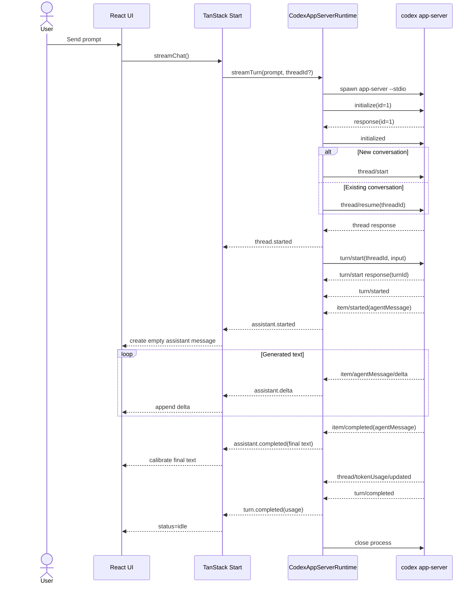

# Codex App Server 真流式：从协议、运行时到前端事件模型

> 适用项目：`CoderLambert/codex-tanstack-start`
>
> 审查基线：`main@6f4584d2f88c93db8b5059ef6e08a1efa3578a19`
>
> 本文不是项目进度记录，而是一篇围绕 **Codex App Server + Agent 流式运行时** 的可迁移技术笔记。阅读目标是：即使离开本仓库，也能独立设计一个可靠的本地 Agent Runtime Adapter。

---

## 1. 先建立正确问题：我们到底要“流式”什么？

在 Agent 应用里，“流式”至少有三种含义：

1. **请求仍在进行**：客户端知道任务没结束。
2. **Agent 生命周期事件在流动**：例如 reasoning、command started、tool completed、file change。
3. **Assistant 正文按增量持续输出**：用户看到回答逐步增长，而不是最后一次性出现。

本项目最初使用 `@openai/codex-sdk` 的 `runStreamed()`。它能够返回 `thread.started`、`item.started`、`item.updated`、`item.completed`、`turn.completed` 等结构化事件，因此属于第 2 类流式；但在实际 `luna` 验证中，没有获得可用的 `agent_message.item.updated` 文本增量，而且当前账号对该模型配置还直接返回了 item error。

真正满足聊天 UI 需求的是第 3 类：**正文 delta streaming**。

Codex App Server 官方协议提供：

```text
item/agentMessage/delta
```

因此项目从：

```text
@openai/codex-sdk
  -> runStreamed()
  -> ThreadEvent
```

迁移为：

```text
codex app-server
  -> JSON messages over stdio
  -> item/agentMessage/delta
  -> application-owned ChatEvent
```

这不是为了“换一个 API”，而是为了换到更底层、信息更完整的 Agent 协议层。

### 核心原则

> **事件流（event streaming）不等于文本增量流（text delta streaming）。**

判断一个 Agent SDK 是否能实现 ChatGPT 式输出，不能只看 API 名字有没有 `stream`，必须确认协议中是否存在可消费的正文 delta。

---

## 2. 为什么 App Server 更适合作为 Agent Runtime

Codex App Server 是一个本地长运行/可长运行的 Agent 协议服务。宿主程序启动 `codex app-server`，通过 stdio 与它交换结构化消息。

本项目当前的边界：

```text
Browser
  │
  │ application ChatEvent
  ▼
TanStack Start Server Function
  │
  ▼
CodexRuntime interface
  │
  ▼
CodexAppServerRuntime
  │
  │ protocol messages
  ▼
codex app-server
  │
  ▼
local Codex / ChatGPT authentication + agent loop
```

与直接在前端消费 App Server 协议相比，这个额外的 Runtime/Normalizer 层非常重要：

- 浏览器不知道 Codex 原始协议。
- 浏览器拿不到本地认证材料。
- UI 不依赖某个模型供应商的事件结构。
- command stdout/stderr、reasoning、MCP arguments/results 可以在 server boundary 被过滤。
- 将来可以增加 Claude、Pi、Qwen Runtime，而不用重写 Chat UI。

这属于典型的 **Anti-Corruption Layer / Adapter Boundary**：把第三方协议转换成自己的稳定领域协议。

---

## 3. JSON-RPC 思维模型：Request、Response、Notification、Server Request

App Server 使用结构化消息通过 stdio 交换。工程上可以把它理解成 JSON-RPC 风格的双向消息协议。

### 3.1 Request

客户端发出带 `id` 的请求：

```json
{
  "id": 3,
  "method": "turn/start",
  "params": {
    "threadId": "thr_123",
    "input": [{ "type": "text", "text": "解释这段代码" }]
  }
}
```

### 3.2 Response

服务端用相同 `id` 返回结果：

```json
{
  "id": 3,
  "result": {
    "turn": {
      "id": "turn_456",
      "status": "inProgress",
      "items": []
    }
  }
}
```

因此客户端必须维护：

```text
request id -> pending request
```

不能简单假设下一条 stdout 消息就是当前请求的响应。

### 3.3 Notification

没有请求 `id`，表示服务端主动广播状态变化：

```json
{
  "method": "item/agentMessage/delta",
  "params": {
    "threadId": "thr_123",
    "turnId": "turn_456",
    "itemId": "msg_1",
    "delta": "React "
  }
}
```

一个请求等待 response 期间，notification 完全可能先到。

本项目因此在 `AppServerConnection.request()` 中缓存 notification：

```ts
const notifications: AppServerMessage[] = []

while (true) {
  const message = await this.nextMessage()

  if (message.id === id) {
    return { response: message, notifications }
  }

  if (message.method) {
    notifications.push(message)
  }
}
```

这个设计比“发请求 -> 读下一行”正确得多。

### 3.4 Server Request

App Server 还可能主动向宿主发送带 `id + method` 的请求，例如 approval / elicitation / attestation 类交互。

因此双向协议客户端至少要识别四类消息：

| 类型 | `id` | `method` | 宿主行为 |
|---|---:|---|---|
| Request | 有 | 有 | 发往 server |
| Response | 有 | 无 | 匹配 pending request |
| Notification | 无 | 有 | 分发为事件 |
| Server Request | 有 | 有 | 必须响应/拒绝 |

当前项目为了 V0 read-only + no approval，统一拒绝 server request：

```ts
error: {
  code: -32000,
  message: 'Interactive server requests are disabled.'
}
```

这在当前安全模型下合理，但未来启用写操作、审批或 MCP elicitation 时必须升级为真正的 request handler。

---

## 4. 连接初始化：为什么 initialize / initialized 是协议握手

官方要求每个连接先执行：

```text
initialize request
      ↓
initialize response
      ↓
initialized notification
```

本项目：

```ts
await connection.request('initialize', {
  clientInfo: {
    name: 'codex-tanstack-demo',
    title: 'Codex TanStack Start Demo',
    version: '0.1.0',
  },
  capabilities: {
    experimentalApi: true,
    requestAttestation: false,
  },
})

connection.notify('initialized')
```

这不是可选的礼貌流程，而是连接状态机的一部分。未初始化连接上的后续请求会被拒绝。

### 能力协商的意义

`capabilities` 不是普通配置，而是“这个客户端会不会理解某些协议行为”的声明。

例如：

- `experimentalApi`
- notification opt-out
- attestation
- MCP form elicitation

因此长期实现不要在协议客户端里把 capability 当作随手拼的 JSON；它应该属于 Connection Configuration。

官方参考：

- https://developers.openai.com/codex/app-server/

---

## 5. Thread / Turn / Item：理解 Codex 的三层领域模型

这是整套 App Server 最重要的心智模型。

```text
Thread
├── Turn 1
│   ├── userMessage
│   ├── reasoning
│   ├── commandExecution
│   ├── fileChange
│   └── agentMessage
│
├── Turn 2
│   ├── userMessage
│   └── agentMessage
│
└── Turn 3 ...
```

### Thread

一个持久对话上下文。

- 新会话：`thread/start`
- 继续会话：`thread/resume`
- 后续还可以 list/read/fork/archive

### Turn

一次“用户请求 + Agent 完成这次工作的全过程”。

调用：

```text
turn/start
```

开始一个 turn。

Turn 不是一条 Assistant 消息。它可能包含：

- 多个 reasoning item
- 多个 command execution
- MCP tool calls
- file changes
- 一个或多个 agent message 阶段

### Item

Turn 中的工作单元。

常见：

```text
userMessage
agentMessage
reasoning
commandExecution
fileChange
mcpToolCall
webSearch
```

### 为什么不能把 Thread 等同于前端 Message[]？

因为：

```text
前端 transcript
```

是展示模型；

而：

```text
Codex thread
```

是 Agent 执行上下文模型。

二者可能相关，但不应该互相替代。

本项目目前只把：

```text
threadId + visible messages
```

持久化到浏览器；真正 thread history 仍由 Codex 管理。这种边界非常适合 V0。

---

## 6. thread/start 与 thread/resume

当前 Runtime：

```ts
const threadRequest = threadId ? 'thread/resume' : 'thread/start'

const threadResult = await connection.request(threadRequest, {
  ...(threadId ? { threadId } : {}),
  cwd: workingDirectory,
  model: LUNA_HIGH_OPTIONS.model,
  approvalPolicy: LUNA_HIGH_OPTIONS.approvalPolicy,
  sandbox: LUNA_HIGH_OPTIONS.sandbox,
})
```

逻辑可以抽象成：

```text
没有 threadId
  -> thread/start
  -> 得到 activeThreadId

已有 threadId
  -> thread/resume(threadId)
  -> 得到 activeThreadId
```

为什么仍然从 response 再解析 `activeThreadId`，而不是盲信输入？

因为 response 才是 Runtime 的权威确认值。

```ts
const activeThreadId = threadIdFromResponse(threadResult.response)
```

这是很值得迁移的工程原则：

> **状态切换完成后，以服务端确认的 canonical identity 为准。**

---

## 7. turn/start：一次 Agent 执行真正从这里开始

本项目：

```ts
const turnResult = await connection.request('turn/start', {
  threadId: activeThreadId,
  input: [{ type: 'text', text: prompt }],
  cwd: workingDirectory,
  model: LUNA_HIGH_OPTIONS.model,
  effort: LUNA_HIGH_OPTIONS.effort,
  approvalPolicy: LUNA_HIGH_OPTIONS.approvalPolicy,
  sandboxPolicy: LUNA_HIGH_OPTIONS.sandboxPolicy,
})
```

这组字段实际分成三类：

### 内容

```text
threadId
input
```

### 模型执行参数

```text
model
effort
cwd
```

### 权限 / 安全参数

```text
approvalPolicy
sandboxPolicy
```

把这三类概念区分开，对后续做“用户可选模型”和“管理员固定安全策略”非常重要。

UI 可以控制：

```text
model / effort
```

但不代表 UI 应该能控制：

```text
sandbox / network / approvals
```

安全策略应该留在可信 server boundary。

---

## 8. 真正的文本流：item/agentMessage/delta

实际验证序列：

```text
thread/started
→ turn/started
→ item/started(agentMessage)
→ item/agentMessage/delta
→ item/agentMessage/delta
→ ...
→ item/completed(agentMessage)
→ thread/tokenUsage/updated
→ turn/completed
```

这才是“用户看到正文逐渐长出来”的数据来源。

### 生命周期映射

Codex 协议：

```text
item/started(agentMessage)
item/agentMessage/delta
item/completed(agentMessage)
```

应用协议：

```text
assistant.started
assistant.delta
assistant.completed
```

映射的目的不是改名字，而是**切断 UI 与 Codex 协议耦合**。

```text
Codex App Server
    │
    │ provider-specific
    ▼
CodexThreadEvent
    │
    │ normalization boundary
    ▼
ChatEvent
    │
    │ application-specific
    ▼
React reducer
```

### 为什么 completed 仍然重要？

因为 delta 是增量过程，`item/completed` 才是最终 authoritative state。

官方文档同样强调：最终 `item/completed` 应作为最终状态依据。

因此推荐模型：

```text
started  -> 建立 UI entity
delta    -> 乐观追加
completed -> 用最终 snapshot 校准
```

这是一种 **stream + final reconciliation** 模式。

它不仅适用于 LLM：文件上传、语音转写、协作编辑、长任务进度都可复用。

---

## 9. Snapshot 与 Delta：为什么两种模型都要理解

有的上游提供 delta：

```text
"React "
"是一个 "
"UI 库"
```

有的上游提供累计 snapshot：

```text
"React"
"React 是一个"
"React 是一个 UI 库"
```

项目 normalizer 保留了对 snapshot update 的兼容：

```ts
if (item.text.startsWith(previous)) {
  const delta = item.text.slice(previous.length)
  return [{ type: 'assistant.delta', id: item.id, delta }]
}
```

如果新 snapshot 不是旧 snapshot 的前缀：

```ts
return [{
  type: 'assistant.completed',
  id: item.id,
  text: item.text,
}]
```

这是正确的防重复思想：

> 非 append-only snapshot 不能安全地转换成 append-only delta。

例如：

```text
old = "React isa"
new = "React is a"
```

简单：

```ts
new.slice(old.length)
```

会得到错误结果。

### 更可靠的通用策略

```text
如果上游明确给 delta：直接追加
如果上游给 snapshot：
  - prefix -> 算 suffix delta
  - non-prefix -> full replacement
最终 completed -> authoritative replace
```

---

## 10. threadId / turnId correlation：流式系统不能只看事件类型

这是当前 `main` 最重要的可靠性缺口之一。

官方 notification 通常带：

```text
threadId
turnId
itemId
```

而当前实现结束循环的条件是：

```ts
if (message.method === 'turn/completed') return
```

问题是它没有验证这个 `turn/completed` 是否属于当前 turn。

在“每个请求 spawn 一个 app-server，且单 turn 独占连接”的 V0 中，碰撞概率较低；但一旦演进到：

- long-lived connection
- 多 thread
- 并发 turn
- steer
- interrupt
- detached review

仅靠 method 已经不够。

### 推荐实现

从 `turn/start` response 保存：

```text
activeThreadId
activeTurnId
```

每个 notification 进入业务层前判断：

```ts
belongsToTurn(message, activeThreadId, activeTurnId)
```

至少：

```text
threadId == activeThreadId
turnId   == activeTurnId
```

然后：

```text
turn/completed(other turn) -> 忽略/路由给其他订阅者
turn/completed(active turn) -> 结束当前 iterator
```

### 可迁移结论

> **在 multiplexed event stream 中，事件类型解决“是什么”，correlation id 解决“是谁的”。**

两者缺一不可。

---

## 11. tokenUsage：为什么 usage 是流中的独立状态

当前 runtime 维护：

```ts
type UsageState = { value: CodexUsage }
```

收到：

```text
thread/tokenUsage/updated
```

后更新：

```ts
usage.value = last
```

最终在 `turn.completed` 转换成：

```ts
{
  type: 'turn.completed',
  usage: usage.value,
}
```

这里值得注意：官方把它定义为 thread usage update；当前代码把 `tokenUsage.last` 暂存并附着到应用层 turn completion。

这是一种 Adapter 层聚合：

```text
provider notifications
    ↓
small local state
    ↓
application event
```

它说明 normalizer 不一定必须是纯粹 1:1 映射；只要状态范围明确，它也可以承担协议重组。

长期应该明确字段语义：

```text
last
cumulative
thread total
turn usage
```

不要仅凭变量名 `usage` 假定含义。

---

## 12. Read-only Sandbox：安全不是一个开关

项目固定：

```ts
const LUNA_HIGH_OPTIONS = {
  model: 'luna',
  effort: 'high',
  approvalPolicy: 'never',
  sandbox: 'read-only',
  sandboxPolicy: {
    type: 'readOnly',
    networkAccess: false,
  },
}
```

这里其实有三条独立防线：

### sandbox = read-only

限制 filesystem mutation 能力。

### networkAccess = false

限制 sandbox 中的网络访问。

### approvalPolicy = never

表示当前宿主不走交互审批升级权限的路径。

三者不能互相替代。

例如：

```text
read-only != no network
no approval != sandboxed
no network != no local data read
```

### 安全模型的正确表达

不要写：

> “开启 read-only，所以安全。”

应该写：

> “当前 V0 通过只读 sandbox、关闭 sandbox network access、不提供 interactive approval、限制浏览器可见事件四层策略，把能力收敛到 repository inspection / explanation 类工作流。”

这才是 threat model 语言。

---

## 13. ChatGPT 本地认证复用：认证为什么必须留在 Server

本项目不要求把 OpenAI API Key 发给浏览器。

App Server 运行在本机 server process 上，复用宿主已有的 Codex / ChatGPT 登录状态。

边界：

```text
Browser
  X 不能访问 ~/.codex 等认证状态

TanStack server
  ↓ spawn
codex app-server
  ↓
local Codex auth
```

应用只需要知道：

```text
runtime 能不能成功工作
```

不应该知道：

```text
具体 token
session
cookie
credential path
```

### 通用原则

> **把 credential consumption 放在离 credential 最近的可信进程；上层只消费能力，不消费凭证。**

这和数据库连接、SSH agent、OS keychain、云凭据代理是同一个设计模式。

---

## 14. 敏感信息隔离：不要把“结构化事件”误认为“安全事件”

App Server 原始事件可能包含：

- reasoning text
- command stdout/stderr
- command cwd
- file path / diff
- MCP arguments/results
- upstream error detail
- local runtime path

因此 server normalizer 是安全边界。

当前项目明确不把这些内容发给浏览器：

```text
raw reasoning       -> 不转发
command output      -> 不转发
MCP arguments       -> 不转发
MCP result          -> 不转发
```

例如 MCP item 映射：

```ts
return {
  id,
  type: 'mcp_tool_call',
  server,
  tool,
  arguments: undefined,
  result: undefined,
  error: undefined,
  status: ...,
}
```

测试还专门检查：

```ts
expect(JSON.stringify(events)).not.toContain('SECRET')
```

### 当前仍需加强的地方

`sanitizeErrorMessage()` 主要处理 token 风格秘密：

```text
Bearer ...
sk-...
sess-...
session-...
token-...
```

但绝对文件路径等 diagnostics 仍可能泄漏。

更稳健的生产策略是：

```text
Server log: 原始详细错误
Browser: code + 泛化 message + traceId
```

而不是试图用越来越复杂的 regex 清洗所有错误字符串。

---

## 15. 进程生命周期：当前 process-per-turn 方案

现在每次 `streamTurn()`：

```text
spawn codex app-server
→ initialize
→ thread/start|resume
→ turn/start
→ consume stream
→ turn/completed
→ close process
```

### 优点

- 隔离简单。
- 一个 turn 出故障不污染后续连接。
- 无需实现复杂的订阅路由。
- Demo 容易理解和验证。

### 缺点

- 每个 turn 都有进程启动成本。
- 每次都要 initialize。
- 无法自然承载多 thread multiplexing。
- `turn/steer` / `turn/interrupt` / approval 等跨请求操作变复杂。
- 不适合未来多 Agent / 多窗口 desktop host。

### process-per-turn vs long-lived

| 维度 | Process per turn | Long-lived app-server |
|---|---|---|
| 实现复杂度 | 低 | 高 |
| 故障隔离 | 强 | 需要客户端治理 |
| 启动开销 | 每次都有 | 一次 |
| 多 thread | 不自然 | 自然 |
| interrupt/steer | 较难 | 自然 |
| approval routing | 简单拒绝 | 可完整实现 |
| Desktop Agent | 不理想 | 推荐 |
| V0 Demo | 推荐 | 可能过度设计 |

### 推荐演进

保持现有：

```ts
interface CodexRuntime
```

不要让 UI 感知进程模型。

未来只需把实现从：

```text
CodexAppServerRuntime
  -> connection per turn
```

换成：

```text
CodexAppServerRuntime
  -> shared connection manager
  -> request router
  -> turn subscriptions
```

上层不变。

---

## 16. Abort 与 turn/interrupt：这两个动作不是一回事

当前 runtime：

```ts
const abortHandler = () => connection.close().catch(() => undefined)
input.signal?.addEventListener('abort', abortHandler, { once: true })
```

也就是说 AbortSignal 当前语义是：

```text
abort
→ close app-server connection/process
```

这属于 **transport/process cancellation**。

官方协议还提供：

```json
{
  "method": "turn/interrupt",
  "id": 31,
  "params": {
    "threadId": "thr_123",
    "turnId": "turn_456"
  }
}
```

成功后当前 turn 最终会：

```text
turn/completed status=interrupted
```

这属于 **domain cancellation**。

### 二者区别

```text
Abort HTTP / stream / process
= 我不再等待这个 transport

turn/interrupt
= 请 Agent runtime 正式中止这个 turn
```

关闭浏览器 stream 并不自动等于 Agent 已停止。

### 推荐 Stop 流程

```text
User clicks Stop
      ↓
Client aborts UI transport (optional, for responsiveness)
      ↓
Server sends turn/interrupt(threadId, turnId)
      ↓
App Server acknowledges
      ↓
turn/completed(status=interrupted)
      ↓
State converges to interrupted
```

如果是 process-per-turn，可把 kill process 作为最后兜底，但不应把 kill 当作唯一领域协议。

---

## 17. Child Process shutdown：为什么需要 timeout + SIGKILL 兜底

当前：

```ts
await new Promise<void>((resolve) => {
  const finish = () => resolve()
  this.child.once('exit', finish)
  this.child.kill()
})
```

这里隐含假设：

```text
SIGTERM -> child 一定退出
```

生产环境不能依赖这个假设。

更健壮的模式：

```text
close called
  ↓
mark closing (idempotent)
  ↓
close stdin/readline
  ↓
SIGTERM
  ↓
wait N ms
  ├─ exited -> done
  └─ alive  -> SIGKILL
```

还应考虑：

- spawn error
- stdin EPIPE
- stdout EOF
- malformed JSON
- stderr 无限增长
- child exits before pending requests settle

这部分属于 Agent Host 的基础设施能力，而不是 Codex 特有知识。

---

## 18. 关键源码映射

### `src/server/codex/codex-app-server.server.ts`

职责：

```text
spawn app-server
stdio framing
request / response matching
notification buffering
server request rejection
protocol -> CodexThreadEvent
thread start/resume
turn start
usage accumulation
process cleanup
```

这是当前最核心的 provider adapter。

### `src/server/codex/codex-runtime.ts`

定义稳定 Runtime interface：

```ts
interface CodexRuntime {
  streamTurn(
    input: StreamCodexTurnInput
  ): AsyncGenerator<CodexThreadEvent>
}
```

价值：把“上层需要什么”与“Codex 怎么实现”拆开。

### `src/server-functions/codex-event.types.ts`

是 server-side structural mirror。

注意：它不是浏览器 contract，也不是官方完整协议 schema。

### `src/server-functions/codex-event-normalizer.ts`

职责：

```text
CodexThreadEvent
  -> ChatEvent
```

这里同时承担：

- provider decoupling
- data minimization
- security filtering
- assistant snapshot state
- usage normalization

### `src/server-functions/chat-stream.ts`

每个 turn 创建一个 stateful normalizer：

```ts
const normalizer = createCodexEventNormalizer()
```

这是关键，因为 snapshot map 必须跨同一 stream 的多个事件存活。

---

## 19. 完整时序图



---

## 20. 当前代码中值得保留的设计

### 20.1 Runtime interface

正确。它避免把 App Server 进程模型扩散到 UI。

### 20.2 application-owned ChatEvent

正确。UI 不应该消费 raw Codex protocol。

### 20.3 delta + completed 校准

正确。过程响应和最终权威状态分开。

### 20.4 normalizer 内过滤敏感 payload

正确。安全边界必须放在 server。

### 20.5 每个 stream 一个 normalizer instance

正确。否则 snapshot 状态每次调用都会丢失。

---

## 21. 当前代码中需要继续修的地方

### P1：缺少 threadId / turnId correlation

不要只靠：

```ts
message.method === 'turn/completed'
```

结束 stream。

### P1：Stop 还不是协议级 interrupt

AbortSignal 关闭 process != `turn/interrupt`。

### P1/P2：process close 缺少强制退出 timeout

避免 child 不退出导致请求永久等待。

### P2：error sanitization 应改为结构化错误

不要依赖 regex 完成全部数据防泄漏。

### P2：AppServerConnection 测试深度不足

现有测试主要验证 notification mapper 和 MCP secret 不泄漏，还没有锁死：

- response id routing
- interleaved notification buffering
- wrong turn notification filtering
- server request
- premature child exit
- malformed JSON
- abort
- shutdown escalation

---

## 22. 如何抓真实事件验证协议

调试时不要一开始打印完整 payload；Agent 事件可能包含敏感数据。

推荐临时只记录 metadata：

```ts
console.error('[codex-event]', {
  method: message.method,
  id: message.id,
  threadId: getThreadId(message),
  turnId: getTurnId(message),
  itemType: getItemType(message),
  itemId: getItemId(message),
  textLength: getTextLength(message),
})
```

验证目标：

```text
1. initialize handshake 是否正确
2. thread/start|resume response 是否返回 thread id
3. turn/start response 是否返回 turn id
4. agentMessage 是否先 started
5. delta 是否连续出现
6. completed text 是否等于最终可见文本
7. turn/completed 的 id/status 是否匹配本 turn
8. usage update 在哪个时点出现
```

### 不推荐

```ts
console.log(JSON.stringify(message))
```

长期保留在生产 server 中。

因为可能记录：

- command output
- MCP result
- paths
- reasoning
- credentials-like strings

---

## 23. 常见故障与排查路径

### 23.1 `codex` 找不到

检查：

```bash
which codex
codex --version
```

项目支持：

```text
CODEX_APP_SERVER_PATH
```

用来指定 executable。

### 23.2 app-server 启动后立刻退出

看 server stderr，不要把 stderr 原样发浏览器。

重点检查：

```text
CLI version
auth state
unsupported flags
working directory
model availability
```

### 23.3 有生命周期事件，但没有文本流

确认是否真正收到：

```text
item/agentMessage/delta
```

不要只看：

```text
item/started
item/completed
```

### 23.4 出现 delta，但 UI 最后重复文本

检查是否把：

```text
delta
```

误当成：

```text
snapshot
```

或者同时将 snapshot update 与真实 delta 双重追加。

### 23.5 New Chat 后老任务还在跑

这通常是：

```text
generation guard 只保护 UI
```

但没有：

```text
turn/interrupt
```

### 23.6 stream 永远不结束

需要区分：

- 模型仍在工作
- tool call 卡住
- response stream disconnected
- `turn/completed` 没收到
- 收到了别的 turn 的 completed
- child process 半死不活

不要只加一个无限大的 HTTP timeout。

---

## 24. 测试策略：不要只测试 Mapper

### Layer 1：纯函数测试

测试：

```text
App Server item -> CodexThreadEvent
CodexThreadEvent -> ChatEvent
snapshot -> delta
error sanitization
usage mapping
```

当前已有一部分。

### Layer 2：Fake App Server transport

建议实现 fake child/transport，脚本化输出：

```text
client initialize
server response
notification A
notification B
request response
wrong-turn completed
right-turn completed
EOF
```

关键断言：

```text
request ID 正确关联
等待 response 期间 notification 不丢
wrong turn 不结束 stream
right turn 才结束
server request 被正确处理
```

### Layer 3：Process integration test

启动一个 fake executable，通过 stdin/stdout 模拟 app-server。

覆盖：

```text
spawn failure
malformed JSON
stderr
exit before response
SIGTERM ignored -> SIGKILL
```

### Layer 4：Real smoke test

在具备本地 Codex auth 的环境运行一次：

```text
thread/start
turn/start
agentMessage delta >= 2
item/completed
turn/completed
```

真实 smoke test 的意义是验证：

```text
我们的协议假设
≈ 当前安装版本真实行为
```

但它不能替代 deterministic unit/integration test。

---

## 25. Fake transport 场景示例

最值得补的一组测试：

```text
turn/start response: turn-A

notification:
  delta(turn-B)       -> 不应进入 A
  delta(turn-A,"Hi") -> 应进入 A
  completed(turn-B)   -> 不应结束 A
  delta(turn-A,"!")  -> 应进入 A
  completed(turn-A)   -> A 结束
```

预期应用事件：

```text
assistant.delta("Hi")
assistant.delta("!")
turn.completed
```

这个测试一旦存在，未来做 long-lived App Server 时会非常有价值。

---

## 26. Approval / Server Request：未来开启写能力后会发生什么

V0 统一拒绝 interactive server request 是合理的，因为：

```text
sandbox=read-only
approvalPolicy=never
```

目标就是不给升级权限路径。

未来如果开启 workspace write，必须设计：

```text
App Server server request
      ↓
Runtime maps to ApprovalRequest
      ↓
Backend assigns request identity
      ↓
Browser renders explicit approval UI
      ↓
User allow/deny
      ↓
Backend validates request still active
      ↓
response to App Server
```

不能把 raw server request 直接发前端然后信任前端原样回传。

安全相关决策必须 server-side 再验证。

---

## 27. MCP 支持：事件显示与协议执行应分层

当前浏览器只看到类似：

```text
Tool: github / search
```

而不会看到：

```text
arguments
result
```

这是一种很好的默认数据最小化策略。

将来若要做 MCP Inspector，可以新增一个显式权限等级：

```text
summary-only
safe-details
full-debug(local development only)
```

而不是直接删除当前安全边界。

---

## 28. turn/steer：为什么 long-lived runtime 后会更有价值

`turn/steer` 用于向**当前仍在执行的 turn**追加输入。

它和新建下一轮：

```text
turn/start
```

语义不同。

典型 UX：

```text
Codex 正在做复杂任务
User: “先别改测试文件”
```

如果支持 steer：

```text
当前 turn 继续，但获得新约束
```

如果不支持，只能：

```text
Stop -> 新 turn
```

这也是为什么真正的 Agent UI 最终通常需要保存 active turn identity。

---

## 29. 多 Thread / 多 Agent：从单 iterator 演进到事件路由器

当前模型：

```text
1 streamTurn
  -> 1 process
  -> 1 active turn
```

未来：

```text
1 AppServerConnection
  ├─ Thread A / Turn A1
  ├─ Thread B / Turn B1
  └─ Thread C / Turn C2
```

这时需要：

```text
Connection Reader
      ↓
Protocol Decoder
      ↓
Correlation Router
      ├─ thread A subscribers
      ├─ thread B subscribers
      ├─ pending RPC promises
      └─ server request handlers
```

也就是说，`AsyncGenerator` 仍然可以作为上层 API，但底层不能再由每个 generator 独占 stdout iterator。

这是从 Demo Runtime 到 Desktop Agent Host 的关键架构跃迁。

---

## 30. 与 SSE / WebSocket 的关系

Codex App Server stdio 只解决：

```text
TanStack server <-> Codex
```

它没有规定：

```text
Browser <-> TanStack server
```

浏览器侧仍可以选择：

| Transport | 适合场景 |
|---|---|
| TanStack async server function | 当前 Demo，类型集成好 |
| SSE | server -> browser 单向事件，非常适合 Agent stream |
| Fetch ReadableStream | 自定义协议、控制直接 |
| WebSocket | steer、approval、双向 realtime、多任务 |

因此不要把“Codex App Server 用 stdio”误解成“整个应用都必须用 stdio”。

正确分层：

```text
Browser Transport
!=
Agent Runtime Transport
```

---

## 31. 可迁移到其他 Agent Runtime 的抽象

从本项目提炼出来，最有价值的不是 `codex app-server` 命令本身，而是下面这个通用模型：

```text
Provider Runtime
      ↓
Provider Events
      ↓
Runtime Adapter
      ↓
Application Events
      ↓
State Machine
      ↓
UI
```

统一应用事件可以是：

```ts
type AgentEvent =
  | { type: 'message.started'; id: string }
  | { type: 'message.delta'; id: string; delta: string }
  | { type: 'message.completed'; id: string; text: string }
  | { type: 'activity.started'; ... }
  | { type: 'activity.updated'; ... }
  | { type: 'activity.completed'; ... }
  | { type: 'turn.completed'; ... }
  | { type: 'error'; ... }
```

然后：

```text
Codex -> adapter A
Claude -> adapter B
Pi    -> adapter C
```

UI 不需要知道 provider。

---

## 32. 设计反例

### 反例 1：前端直接消费 raw App Server event

问题：

```text
provider lock-in
敏感信息泄漏
协议升级影响 UI
测试困难
```

### 反例 2：收到 delta 后每次创建新 message

问题：

```text
"React"
" 是"
" UI"
```

变成 3 条聊天消息。

应该按 `itemId` 聚合同一个 entity。

### 反例 3：completed 到来时继续 append final text

会得到：

```text
React is UIReact is UI
```

completed 应做 reconciliation/replacement。

### 反例 4：New Chat 只清 React state

旧 runtime 继续耗 token / 执行工具。

UI cancellation 和 runtime interruption 必须分开考虑。

### 反例 5：所有错误原样透传

本地 Agent 的错误字符串往往比普通 SaaS API 更敏感，因为它能包含 filesystem/runtime 信息。

---

## 33. 推荐的下一阶段 Runtime 结构

```text
CodexRuntime
│
├── startTurn(...): TurnHandle
│
└── TurnHandle
    ├── threadId
    ├── turnId
    ├── events: AsyncIterable<AgentEvent>
    ├── interrupt()
    └── dispose()
```

相比现在单一：

```ts
streamTurn(): AsyncGenerator
```

`TurnHandle` 更适合后续：

- Stop
- Steer
- active turn status
- multi-tab
- background turn
- telemetry

但对当前 V0，不必急着改；先补 correlation 和 interrupt 即可。

---

## 34. 最小可靠性 Checklist

实现任意本地 Agent Runtime Adapter 时，至少回答这些问题：

- [ ] 是否区分 request / response / notification / server request？
- [ ] pending request 是否按 request id 关联？
- [ ] 等 response 时到达的 notification 会不会丢？
- [ ] 事件是否按 threadId / turnId 关联？
- [ ] message delta 是否按 itemId 聚合？
- [ ] completed 是否作为最终权威 snapshot？
- [ ] UI abort 是否真的停止 runtime？
- [ ] 是否有领域级 interrupt？
- [ ] child process 卡死怎么退出？
- [ ] stderr 如何处理？
- [ ] raw reasoning/command/MCP data 会不会泄漏到 browser？
- [ ] error message 是否可能泄漏路径和凭据？
- [ ] sandbox、network、approval 是否分别建模？
- [ ] 真实 runtime 版本变化如何 smoke test？

---

## 35. 复习题

### 基础

1. `runStreamed()` 为什么不必然意味着 Assistant 正文是 token/delta 流？
2. Thread、Turn、Item 各自解决什么问题？
3. `item/agentMessage/delta` 与 `item/completed(agentMessage)` 的职责有什么区别？
4. 为什么 UI 不应该直接依赖 Codex App Server event shape？
5. `initialize` 与 `initialized` 分别是什么类型的消息？

### 进阶

6. 为什么等待某个 RPC response 时必须缓存穿插到达的 notification？
7. 为什么 `turn/completed` 必须用 `turnId` correlation，而不能只判断 method？
8. 为什么浏览器取消读取 stream 不等于 Agent turn 已中断？
9. snapshot 转 delta 时，为什么 non-prefix update 不能直接做字符串 slice？
10. `sandbox: read-only`、`networkAccess: false`、`approvalPolicy: never` 为什么是三种不同控制？

### 工程设计

11. 如果把 app-server 改成长连接，你会怎样设计 pending request map 与 event router？
12. 怎样测试“wrong turn completed 不会结束 current turn”？
13. 当 App Server 发来 approval request 时，为什么不能直接把原始 request 交给浏览器决定？
14. process-per-turn 为什么适合 Demo，却不适合作为桌面 Agent 的最终架构？
15. 如果未来增加 Claude/Pi Runtime，哪些层应复用，哪些层应该 provider-specific？

---

## 36. 一页总结

```text
真正的 Agent 流式 UI
不是“API 返回一个 stream”这么简单。

它需要：

1. Runtime 有真实增量事件
   Codex: item/agentMessage/delta

2. 协议客户端正确处理 multiplexing
   request id + notification + server request

3. 用 identity 做事件关联
   threadId + turnId + itemId

4. 用应用协议隔离 provider
   raw Codex event -> ChatEvent

5. 流过程与最终状态分开
   delta append + completed reconcile

6. 明确安全边界
   auth / reasoning / command output / MCP payload 不进浏览器

7. 明确取消语义
   transport abort != turn/interrupt

8. 管好本地进程
   spawn / stderr / EOF / timeout / SIGTERM / SIGKILL

9. 测试协议生命周期，而不只是 mapper

10. 当系统走向多 Thread / 多 Agent 时，
    从“一个 generator 独占一个进程”演进为
    “长连接 + correlation router + TurnHandle”。
```

---

## 参考资料

- Codex App Server 官方文档：https://developers.openai.com/codex/app-server/
- 本项目 Runtime：`src/server/codex/codex-app-server.server.ts`
- Runtime interface：`src/server/codex/codex-runtime.ts`
- Runtime event mirror：`src/server-functions/codex-event.types.ts`
- Event normalizer：`src/server-functions/codex-event-normalizer.ts`
- Streaming bridge：`src/server-functions/chat-stream.ts`
- 当前 App Server notification 测试：`src/server/codex/codex-app-server.test.ts`

> 文档中的“当前实现”以 `main@6f4584d2` 为准。协议能力以阅读本文时的官方 App Server 文档为权威来源；App Server 是活跃演进协议，升级 Codex CLI 后应重新进行真实事件 smoke verification。
