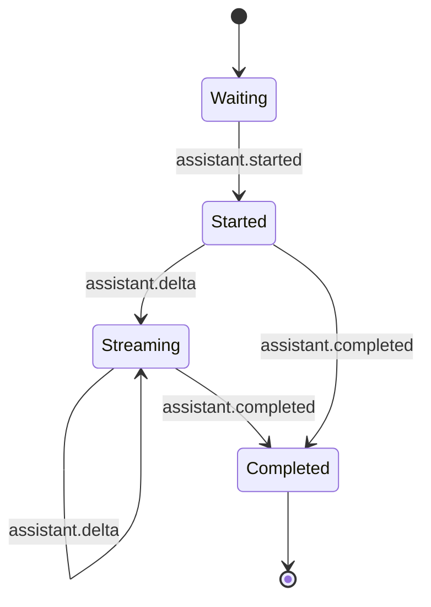
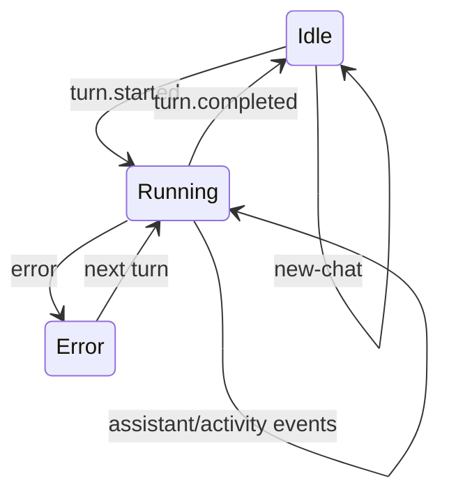
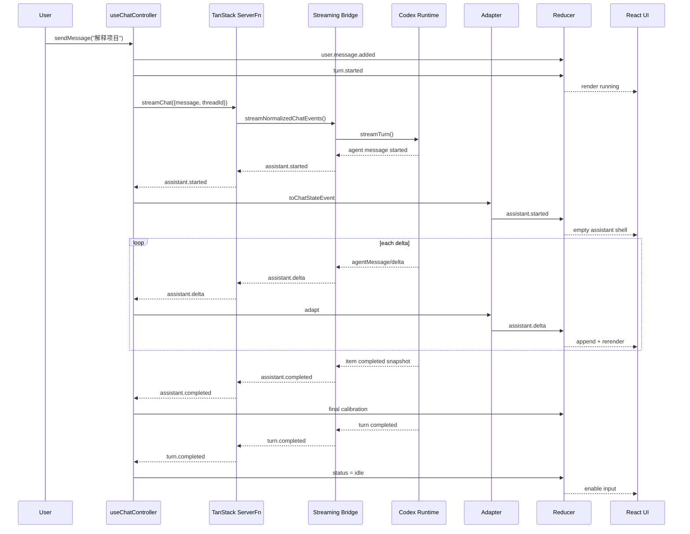

# TanStack Start 流式 RPC 与 React 状态建模

> 本文基于 `codex-tanstack-start` 当前 `main`（`6f4584d2`）的真实实现，目标不是解释“怎么把一个聊天页面跑起来”，而是沉淀一套可迁移到其他 Agent / LLM 前端的流式交互设计方法。

## 1. 先建立正确的问题模型

传统 Web 请求通常是：

```text
用户提交
  ↓
HTTP request
  ↓
服务端完成全部工作
  ↓
一次性 response
  ↓
setState(finalResult)
```

Agent / LLM 场景不同。一次 turn 在真正结束前会持续产生状态：

```text
thread started
turn running
assistant item started
assistant delta
assistant delta
command/tool activity
assistant completed
turn completed
```

因此问题不再只是“请求一个结果”，而是：

> 如何把服务端持续产生的事件安全地穿过 RPC 边界，转换成稳定的应用事件，再用确定性的客户端状态机持续折叠成 UI？

当前项目的主链路是：

```text
React UI
  ↓
useChatController()
  ↓
TanStack Start createServerFn
  ↓
async generator
  ↓
streamNormalizedChatEvents()
  ↓
ChatEvent
  ↓
for await...of
  ↓
toChatStateEvent()
  ↓
chatReducer()
  ↓
React render
```

核心不是某一个 API，而是 **Boundary → Event Contract → State Machine** 三层分离。

---

## 2. `createServerFn` 的 Browser / Server 边界

当前入口：

```ts
export const streamChat = createServerFn({ method: 'POST' })
  .validator(validateChatRequest)
  .handler(async function* ({ data }) {
    yield* streamNormalizedChatEvents(data, streamCodexTurn)
  })
```

文件：

```text
src/server-functions/chat.ts
```

### 2.1 一个容易误解的点

这个模块 **允许被浏览器代码 import**，但 handler 不是因此就进入浏览器 bundle。

浏览器写：

```ts
import { streamChat } from '../../server-functions/chat'
```

调用：

```ts
const events = await streamChat({ data })
```

语义上看像普通函数；构建后实际是：

```text
browser function call
      ↓
TanStack Start RPC bridge
      ↓
server-side handler
```

这就是 Server Function 的价值：

- 浏览器侧获得类型安全调用接口；
- handler 在服务端执行；
- 不需要手写传统 `/api/chat` controller；
- 参数 validator 放在 RPC 入口；
- async iterable 可以继续作为流返回。

### 2.2 为什么 Codex Runtime 必须继续放在 `*.server.ts`

`chat.ts` 虽然 client-importable，但它依赖：

```ts
import { streamCodexTurn } from './chat.runtime.server'
```

真正 runtime 再进入：

```text
src/server/codex/**
```

原因不是目录美观，而是安全与运行环境隔离：

```text
Browser
不能拥有：
- child_process
- 本地 Codex 认证
- filesystem path
- app-server stdio
- command/tool 原始数据
```

如果把 Runtime 直接写进一个可能进入 client graph 的普通模块，会产生两类风险：

1. **构建风险**：Node-only API 被浏览器构建引用；
2. **安全风险**：认证、路径、协议对象意外越过边界。

### 2.3 设计原则

```text
client-importable API ≠ client-executable implementation
```

正确结构：

```text
chat.ts                    // 浏览器可以 import 的 RPC declaration
chat.runtime.server.ts     // server-only integration seam
server/codex/**            // Node runtime / app-server
```

这是 full-stack framework 中非常重要的模块边界意识。

---

## 3. async generator 如何形成真正的 RPC Streaming

服务端：

```ts
.handler(async function* ({ data }) {
  yield* streamNormalizedChatEvents(data, streamCodexTurn)
})
```

bridge：

```ts
export async function* streamNormalizedChatEvents(
  request,
  createCodexTurnStream,
) {
  const source = await createCodexTurnStream(request)
  const normalizer = createCodexEventNormalizer()

  for await (const codexEvent of source) {
    for (const chatEvent of normalizer.normalize(codexEvent)) {
      yield chatEvent
    }
  }
}
```

客户端：

```ts
const events = await streamChat({ data })

for await (const event of events) {
  dispatch({
    type: 'event.received',
    event: toChatStateEvent(event, Date.now()),
  })
}
```

### 3.1 关键点

真正让 UI 流起来的不是 React，也不是 `setState`，而是整条链路每一层都没有把事件收集成数组：

```text
Codex event
  ↓ immediately
normalize
  ↓ immediately
yield ChatEvent
  ↓ immediately
RPC transport
  ↓ immediately
for await
  ↓ immediately
dispatch
  ↓
render
```

如果任何一层写成：

```ts
const events = []
for await (...) events.push(...)
return events
```

流式就会在这一层退化成批量返回。

### 3.2 流式系统的 Backpressure 心智模型

async iterator 天然是消费者驱动：

```text
producer → yield → consumer next() → producer continues
```

它比“无限 callback 推送”更容易控制生命周期，也更适合服务端逐事件转换。

---

## 4. 为什么需要两套 Event Contract

项目当前有两层事件：

### Transport Contract：`ChatEvent`

位置：

```text
src/features/chat/chat.types.ts
```

例如：

```ts
type ChatEvent =
  | { type: 'thread.started'; threadId: string }
  | { type: 'assistant.started'; id: string }
  | { type: 'assistant.delta'; id: string; delta: string }
  | { type: 'assistant.completed'; id: string; text: string }
  | { type: 'turn.completed'; usage: ChatUsage }
  | { type: 'error'; message: string }
```

它回答：

> 服务端允许通过网络告诉浏览器什么？

### State Contract：`ChatStateEvent`

位置：

```text
src/features/chat/chat.reducer.ts
```

例如：

```ts
type ChatStateEvent =
  | { type: 'assistant.started'; id: string; createdAt: number }
  | { type: 'assistant.delta'; id: string; delta: string }
  | { type: 'assistant.completed'; id: string; text: string }
```

它回答：

> reducer 需要什么信息才能确定性地更新本地状态？

### 4.1 两者为什么不能偷懒合并

因为网络事件和 UI 状态的关注点不同。

例如 `assistant.started`：

```text
Transport:
{id}

State:
{id, createdAt}
```

`createdAt` 是客户端持久化消息需要的字段，但没必要让 Codex Runtime 负责。

再例如：

```text
turn.completed transport event
```

携带 token usage；但当前 reducer 只关心：

```text
status: running → idle
```

所以 adapter 会把它收敛为：

```ts
{ type: 'turn.completed' }
```

这是一种 **Anti-Corruption Layer（防腐层）** 思路：

```text
Runtime Protocol
   ↓ normalize
Transport Contract
   ↓ adapt
State Contract
   ↓ reduce
UI State
```

每层只暴露下一层真正需要知道的内容。

---

## 5. Adapter 层不是“多余的一层”

当前 adapter：

```ts
export function toChatStateEvent(
  event: ChatEvent,
  receivedAt: number,
): ChatStateEvent
```

它至少承担三个职责：

### 5.1 注入客户端语义

```ts
case 'assistant.started':
  return {
    type: 'assistant.started',
    id: event.id,
    createdAt: receivedAt,
  }
```

时间属于客户端接收时刻，不应该污染 server transport contract。

### 5.2 丢弃 state 不需要的数据

例如当前 reducer 并不存储 token usage：

```ts
case 'turn.completed':
  return { type: 'turn.completed' }
```

### 5.3 阻止 runtime shape 渗透进 React

如果未来底层从 Codex 换成 Claude / Pi / Qwen，理想情况是：

```text
新 runtime adapter
  ↓
仍然输出 ChatEvent
  ↓
React reducer 不改
```

这就是应用协议稳定性的价值。

---

## 6. `useReducer`：把流式 UI 当状态机，而不是字符串拼接器

当前主状态：

```ts
interface ChatState {
  threadId: string | null
  messages: ChatMessage[]
  activities: AgentActivity[]
  status: 'idle' | 'running' | 'error'
  error: string | null
}
```

一个 assistant response 的生命周期：



整个 turn：



### 6.1 `assistant.started`

创建空 assistant message：

```ts
{
  id,
  role: 'assistant',
  content: '',
  createdAt,
}
```

为什么不是等第一段 delta 再创建？

因为 `started` 是领域事件：

```text
“这条 assistant message 已经存在，只是内容暂时为空。”
```

这样 UI 可以独立展示 loading cursor、message shell 或 metadata。

### 6.2 `assistant.delta`

核心逻辑：

```ts
messages[index] = {
  ...message,
  content: message.content + event.delta,
}
```

这里的 `delta` 是 **增量**，不是 snapshot。

所以：

```text
"React"
+ " 是"
+ "一个 UI 库"
```

最终才得到完整文本。

### 6.3 `assistant.completed`

completed 不只是“状态结束”，还承担最终校准：

```ts
content: event.text
```

即：

```text
delta stream 用于即时体验
completed snapshot 用于最终正确性
```

如果中间某个 delta 因协议、网络或 adapter 问题缺失，最终 snapshot 仍可以纠正消息。

这是非常值得复用的模式：

```text
optimistic incremental state
        +
authoritative final snapshot
```

---

## 7. Reducer 必须是纯函数：当前代码中的真实反例

React reducer 的核心契约：

```text
same state + same action
      ↓
same next state
```

也就是：

```ts
next = reducer(state, action)
```

不能偷偷依赖外界时间、随机数、网络、localStorage。

当前代码有两个值得修正的反例：

```ts
createdAt: Date.now()
```

分别出现在：

- `assistant.delta` 找不到目标 message 的 fallback；
- `assistant.completed` 找不到旧 message 的 fallback。

这意味着同一个 event 重放两次，结果可能不同。

### 正确做法

时间应该在 reducer 外生成：

```ts
toChatStateEvent(event, receivedAt)
```

然后 event 明确携带：

```ts
{
  type: 'assistant.delta',
  id,
  delta,
  receivedAt,
}
```

Reducer 只消费输入。

### 为什么这不仅是“代码洁癖”

纯 reducer 带来：

- 可重复测试；
- event replay；
- time-travel debugging；
- 并发 React 下更稳；
- 更容易迁移到 Zustand reducer / Redux / XState。

---

## 8. Controller：副作用编排层

`useChatController()` 才是副作用应该存在的地方。

它负责：

```text
时间
localStorage
RPC
async iterator
generation guard
dispatch
```

而 reducer 负责：

```text
state + event → next state
```

这是经典分层：

```text
Controller = orchestration / side effects
Reducer    = deterministic state transition
UI         = render(state)
```

### 8.1 为什么需要 `stateRef`

`sendMessage` 被：

```ts
useCallback(..., [])
```

固定住，因此闭包中的 `state` 会变旧。

代码使用：

```ts
const stateRef = useRef(state)

useEffect(() => {
  stateRef.current = state
}, [state])
```

然后：

```ts
stateRef.current.threadId
stateRef.current.status
```

这样长期稳定的 callback 可以读取最新状态。

需要注意：这是一种显式 escape hatch。若 callback 依赖越来越复杂，应重新评估是否值得固定为空依赖。

---

## 9. generation guard：解决 stale stream，但不是 Abort

当前机制：

```ts
const generationRef = useRef(0)
```

开始请求时：

```ts
const generation = generationRef.current
```

消费事件时：

```ts
if (generation !== generationRef.current) return
```

点击 New Chat：

```ts
generationRef.current += 1
```

### 9.1 它解决什么

假设旧会话 A 仍在返回 delta：

```text
A stream
  ↓
New Chat
  ↓ generation 0 → 1
A next delta
  ↓
0 !== 1
  ↓
ignore
```

因此旧流不会污染新会话 B。

这是 **stale-result invalidation**。

### 9.2 它没有解决什么

底层 Agent 可能仍然：

```text
继续推理
继续产生 token
继续执行工具
继续占用 app-server process
```

所以：

```text
generation guard ≠ cancellation
```

真正取消需要把中断一路传播到 Runtime，例如：

```text
UI Stop/New Chat
  ↓
AbortController / interrupt API
  ↓
TanStack server request
  ↓
Codex Runtime
  ↓
turn/interrupt
```

两者职责不同：

| 机制 | 解决的问题 |
|---|---|
| generation guard | 旧结果不能修改当前 UI |
| Abort / interrupt | 停止底层工作 |

健壮系统通常两者都需要。

---

## 10. Persistence：为什么只保存 `threadId + messages`

当前：

```ts
interface PersistedConversation {
  threadId: string | null
  messages: ChatMessage[]
}
```

没有保存：

```text
status
activities
error
```

这是合理的边界。

这些字段可以分为：

### Durable state

```text
threadId
messages
```

刷新后仍然有意义。

### Ephemeral state

```text
running/error/activity
```

它们描述的是“当前页面这一刻发生什么”，刷新后不能安全地假装还能继续。

### 10.1 Versioned storage

当前 key：

```ts
codex-tanstack-demo:conversation:v1
```

并且 envelope 有：

```ts
{ version, conversation }
```

这是正确做法，因为本地持久化格式也是一种 schema。

未来 message shape 改变时，可以：

```text
v1 → migrate → v2
```

或者明确丢弃旧数据。

### 10.2 为什么不能直接 `JSON.parse()` 后信任

代码会逐字段验证：

```text
threadId
messages array
message.id
message.role
message.content
message.createdAt
```

localStorage 是不可信输入：

- 老版本残留；
- 用户 DevTools 手工修改；
- 浏览器插件修改；
- 半写入 / 非预期数据。

因此 parse 与 validation 必须在边界完成。

---

## 11. New Chat 与 Resume 的真正语义

### Resume

发送新消息时 controller 带上：

```ts
threadId: stateRef.current.threadId ?? undefined
```

服务端 Runtime 决定：

```text
有 threadId → resume
无 threadId → start
```

所以浏览器并不保存完整 Agent 上下文，只保存一个 opaque thread identifier。

### New Chat

当前 New Chat：

```ts
dispatch({ type: 'new-chat' })
clearConversation(storage)
```

它表示：

```text
清空浏览器当前 conversation pointer
```

它并不表示：

```text
删除 Codex 后端持久化 thread
```

这是很重要的语义区别：

```text
new local conversation ≠ delete remote/runtime history
```

未来如果提供“历史会话管理”，应该把：

```text
New Chat
Delete Thread
Archive Thread
Resume Thread
```

拆成不同动作。

---

## 12. UI 流式渲染：每个 delta 都会触发什么

当前每个 delta：

```text
for await event
  ↓
dispatch
  ↓
reducer 创建新 messages array
  ↓
React render
  ↓
ChatMessage 更新
```

同时 `ChatPage` 有：

```ts
useEffect(() => {
  scrollAnchorRef.current?.scrollIntoView({ block: 'end' })
}, [messages, activities, status])
```

所以 messages 每变化一次，就会尝试滚到底部。

### 12.1 优点

简单、确定、V0 足够。

### 12.2 高速 token stream 下的潜在问题

如果 delta 非常密集：

```text
每 10ms 一个 delta
```

则可能产生大量：

```text
render
DOM update
scrollIntoView
```

成熟方案可考虑：

- transport 层适度 batching；
- `requestAnimationFrame` 合并 UI append；
- 自动滚动只在用户本来位于底部附近时执行；
- 用户手工向上滚动时暂停 auto-follow。

不要一开始就优化，但必须理解成本来自哪里。

---

## 13. 当前其实还没有 Markdown Streaming

`ChatMessage` 当前是：

```tsx
<div className="message__content">{message.content}</div>
```

也就是纯文本渲染。

这点非常重要：

```text
“文本是流式的”
并不等于
“Markdown renderer 能安全流式增量解析”
```

如果以后接 Markdown，需要处理未闭合语法：

```md
```ts
const a =
```

在中间 delta 阶段可能只有：

```md
```ts
const
```

因此 Markdown streaming 需要考虑：

- parser 对 incomplete syntax 的容忍；
- code block 重解析成本；
- DOM 抖动；
- link / HTML 安全；
- syntax highlighting 是否每个 token 重跑。

实践上更合理：

```text
streaming phase：容忍增量 Markdown
completed phase：最终完整重渲染/校准
```

而不是自己做“打字机动画”。

---

## 14. Error 状态与恢复

Reducer：

```ts
case 'error':
  return {
    ...state,
    status: 'error',
    error: event.message,
  }
```

下一次发送时：

```ts
dispatch({ type: 'user.message.added', ... })
dispatch({ type: 'turn.started' })
```

`turn.started` 会：

```text
status = running
error = null
activities = []
```

这意味着错误不是永久锁死状态，而是可恢复状态。

### 一个工程上需要继续思考的问题

如果 turn 失败时已经收到部分 assistant delta：

```text
assistant: "已经生成一半..."
error
```

应该：

- 保留 partial message？
- 标记 incomplete？
- 删除？
- 提供 retry？

当前模型只记录全局 `error`，还没有 message-level failure metadata。

未来成熟聊天 UI 可以把 message 扩展为：

```ts
status: 'streaming' | 'completed' | 'failed'
```

---

## 15. 事件驱动 UI vs “完成后 setState”

### 完成后更新

```ts
const result = await askAgent(prompt)
setMessages([...messages, result])
```

优点：简单。

缺点：

- 没有流式体验；
- 无法展示 activity；
- 中断困难；
- 工具调用期间 UI 没状态；
- 很难表达 partial failure。

### 事件驱动

```ts
for await (const event of stream) {
  dispatch(event)
}
```

优点：

- streaming 是自然结果；
- 支持 tool/activity；
- 状态迁移可测试；
- 容易增加 interrupt / approval；
- Runtime 和 UI 解耦。

代价：

- 必须认真设计 event schema；
- 必须处理乱序、重复、缺失、stale stream；
- 测试从“结果断言”升级成“事件序列断言”。

Agent UI 更接近事件系统，而不是传统 CRUD 表单。

---

## 16. SSE / WebSocket / Fetch Stream / TanStack Server Function 怎么选

| 方案 | 优点 | 缺点 | 更适合 |
|---|---|---|---|
| TanStack `createServerFn` + async iterable | 类型整合好、项目内调用自然、少样板代码 | 与框架耦合 | 单体 TanStack Start 应用 |
| SSE | 简单、浏览器原生、服务端单向推送语义清晰 | 客户端→服务端控制通常需另一路请求 | token/event 单向流 |
| `fetch()` + ReadableStream | 标准 Web API、控制力强 | framing / parse / type contract 自己维护 | 自定义流协议 |
| WebSocket | 双向、长连接、适合 interrupt/approval/live control | 生命周期、重连、状态同步更复杂 | 高频双向 Agent 会话 |

### 当前项目为什么选择 Server Function 合理

当前目标是：

```text
单人、本地、TanStack Start、一个 chat UI
```

因此不需要为了“未来可能双向”提前引入 WebSocket。

设计原则：

> 用满足当前语义的最简单 transport，同时通过 `ChatEvent` contract 保留未来替换 transport 的能力。

---

## 17. 关键源码地图

```text
src/server-functions/chat.ts
  createServerFn RPC 边界

src/server-functions/chat.runtime.server.ts
  server-only runtime seam

src/server-functions/chat-stream.ts
  runtime event → ChatEvent streaming bridge

src/server-functions/codex-event-normalizer.ts
  Codex event → application transport event

src/features/chat/chat.types.ts
  ChatRequest / ChatEvent transport contract

src/features/chat/chat-event.adapter.ts
  transport event → state event

src/features/chat/chat.reducer.ts
  deterministic state machine

src/features/chat/use-chat-controller.ts
  RPC / storage / async stream / generation orchestration

src/features/chat/chat.storage.ts
  local durable-state schema

src/features/chat/components/chat-page.tsx
  controlled UI + auto scroll

src/features/chat/components/chat-message.tsx
  message rendering（当前纯文本）
```

推荐调试顺序也按这个链路反向定位：

```text
UI 不更新
 ↓
Reducer 是否收到 event？
 ↓
Adapter 是否转换？
 ↓
for await 是否收到 ChatEvent？
 ↓
Server function 是否 yield？
 ↓
Normalizer 是否产生事件？
 ↓
Runtime 是否收到 app-server notification？
```

不要一看到“前端没流式”就直接改 React。

---

## 18. 常见 Bug 模式

### Bug 1：服务端有 stream，UI 仍一次性出现

检查是否某层做了 buffer：

```ts
const all = []
for await (...) all.push(...)
return all
```

### Bug 2：delta 重复

常见原因：把 snapshot 当 delta：

```text
old = "Hello"
new = "Hello world"

错误：append new
→ "HelloHello world"
```

### Bug 3：切换会话后旧回复串进来

缺少 generation / request identity guard。

### Bug 4：Reducer 测试偶发不一致

Reducer 内使用：

```text
Date.now()
Math.random()
localStorage
```

### Bug 5：刷新后出现 running 状态假象

错误持久化 ephemeral state。

### Bug 6：SSR 阶段访问 `window.localStorage`

当前 `getBrowserStorage()` 用：

```ts
if (typeof window === 'undefined') return null
```

就是为了防这个问题。

### Bug 7：用户往上翻历史时被强制拉到底部

无条件 `scrollIntoView()` 的典型 UX 副作用。

---

## 19. 测试应该按事件层分层

### 19.1 Transport normalizer

验证：

```text
runtime event sequence
→ expected ChatEvent sequence
```

### 19.2 Adapter

验证：

```text
ChatEvent + receivedAt
→ deterministic ChatStateEvent
```

重点：时间是否只在 adapter 注入。

### 19.3 Reducer

应该覆盖：

```text
assistant.started
assistant.delta × N
assistant.completed
重复 started
未知 id delta
不同 message id
turn.completed
error → next turn recovery
new-chat
conversation restored
```

并增加纯函数测试：

```ts
expect(reducer(state, event)).toEqual(reducer(state, event))
```

前提是先移除 reducer 内部时钟。

### 19.4 Storage

覆盖：

```text
valid v1
invalid JSON
wrong version
wrong message shape
storage exception
clear
SSR no-window
```

### 19.5 Controller

当前 controller 测试非常轻，应进一步覆盖：

```text
stream event dispatch order
new-chat invalidates stale stream
running 时拒绝重复 send
resume 使用最新 threadId
error path
```

### 19.6 UI

建议使用 React Testing Library 验证行为，而不是 DOM implementation detail：

```text
running → input disabled
message delta → visible text grows
error → alert visible
new chat → history cleared
auto-scroll policy
```

---

## 20. 一条完整时序图



---

## 21. 可复用设计模式

### Pattern A：Application-owned Event Contract

不要让第三方 SDK 类型进入 UI。

```text
Provider Event
→ Adapter
→ App Event
```

### Pattern B：Streaming Delta + Final Snapshot

```text
delta = responsiveness
snapshot = correctness
```

### Pattern C：Controller / Reducer / View 分离

```text
Controller: side effects
Reducer: deterministic transitions
View: render only
```

### Pattern D：Durable / Ephemeral State 分离

只持久化刷新后仍然有真实语义的状态。

### Pattern E：Stale Result Guard + Real Cancellation

两者不是替代关系：

```text
guard 保 UI
interrupt 保资源
```

### Pattern F：Boundary Validation

所有跨边界数据都应该验证：

```text
RPC input
localStorage
provider protocol
```

---

## 22. 当前实现值得继续改进的地方

按优先级：

1. **移除 reducer 内 `Date.now()`**，把时间全部移到 adapter/controller；
2. **增加真正的 abort / `turn/interrupt`**，generation guard 继续保留；
3. **完善 controller integration tests**；
4. **自动滚动改为“仅用户位于底部附近时 follow”**；
5. **引入 Markdown 前先设计 incomplete Markdown streaming 策略**；
6. **消息增加 streaming/completed/failed 状态**，更准确表达 partial failure；
7. 若 delta 频率过高，再引入 rAF batching，而不是预优化。

---

## 23. Review Checklist

以后审核类似 Agent Chat UI，可以逐项检查：

- [ ] 浏览器是否只依赖 application-owned contract？
- [ ] Node/runtime-only 依赖是否明确隔离？
- [ ] 流是否在中间某层被 buffer？
- [ ] delta 与 snapshot 是否语义明确？
- [ ] completed 是否可做最终校准？
- [ ] reducer 是否完全纯函数？
- [ ] controller 是否集中管理副作用？
- [ ] stale stream 是否有 request/generation identity？
- [ ] stale guard 之外是否有真实 cancellation？
- [ ] durable 与 ephemeral state 是否分开？
- [ ] persisted schema 是否 versioned + validated？
- [ ] SSR 是否安全访问 browser API？
- [ ] 自动滚动是否尊重用户手动阅读历史？
- [ ] 流式 Markdown 是否能处理不完整语法？
- [ ] 测试是否覆盖事件序列而不只是最终结果？

---

## 24. 复习题

### 基础

1. 为什么 `createServerFn` 模块可以被浏览器 import，而 Codex runtime 仍必须放在 server-only 模块？
2. async generator 为什么适合表达 LLM / Agent 输出？
3. `ChatEvent` 和 `ChatStateEvent` 分别属于哪一层？
4. 为什么 `assistant.completed` 仍应携带完整文本，而不是只发一个 `done: true`？
5. 为什么只持久化 `threadId + messages`？

### 进阶

6. generation guard 和 AbortController 的问题域有什么区别？
7. 如果 provider 提供的是累计 snapshot，而 UI contract 要的是 delta，应在哪一层转换？为什么？
8. reducer 内调用 `Date.now()` 会破坏哪些工程能力？
9. 如果每 5ms 收到一个 delta，React UI 可能出现哪些性能问题？你会先优化哪里？
10. 为什么未闭合 Markdown 会让 streaming renderer 比纯文本复杂得多？

### 架构思考

11. 如果以后底层从 Codex 改成 Pi Agent，哪些层应该保持不变？
12. 如果产品需要实时 approval、interrupt、steer，多路双向消息增加后，继续使用 Server Function streaming 还是切 WebSocket？判断依据是什么？
13. 如果刷新页面时一个 turn 尚未结束，应用应该恢复成 `running` 吗？为什么？
14. 如果收到 `assistant.delta` 但从未收到 `assistant.started`，系统应丢弃、补建还是报错？不同策略分别有什么 trade-off？
15. 如何设计测试证明“流式 UI 真的是逐事件更新”，而不是最后一次性渲染？

---

## 25. 最终心智模型

不要把 Agent Chat 理解成：

```text
prompt → response
```

更准确的是：

```text
Provider Runtime
   ↓ produces domain events
Server Boundary
   ↓ normalizes
Application Transport Events
   ↓ streams
Client Adapter
   ↓ enriches / narrows
State Events
   ↓ folds
Deterministic State Machine
   ↓ renders
UI
```

一旦建立这个模型，流式文本、工具活动、中断、审批、多 Agent、持久化都只是“新增事件和状态迁移”，而不是不断给一个巨型 `sendMessage()` 打补丁。
