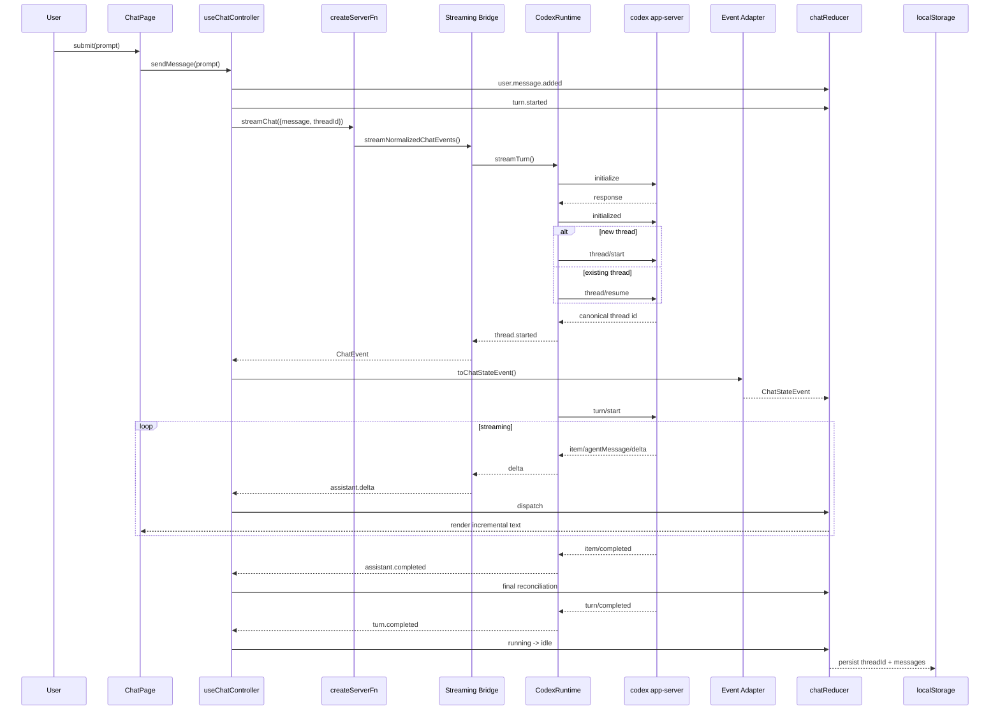

# 端到端架构复盘：从一次用户消息到生产级 Agent 系统

> 基线：`main@294ecae6`
>
> 这篇不是第五个孤立专题，而是一份“把前四篇串起来”的源码型复盘。目标是让你以后拿到任何一个 Agent Web 项目，都能沿完整链路判断：边界是否清楚、流式是否真实、状态是否可靠、失败是否能收敛、安全是否可解释。

---

## 1. 先用一条消息串起整个系统



把它压缩成架构公式：

```text
User Intent
→ RPC Boundary
→ Runtime Protocol
→ Application Event
→ State Event
→ Deterministic Projection
→ UI
```

每一次箭头都是一个需要审查的边界。

---

## 2. 第一条总原则：跨边界时必须“收敛语义”

错误架构常见模式：

```text
Codex raw event
→ 一路透传
→ React switch(method)
```

短期代码少，长期所有层都知道供应商协议。

本项目采用：

```text
AppServerMessage
  ↓
CodexThreadEvent
  ↓
ChatEvent
  ↓
ChatStateEvent
  ↓
ChatState
```

为什么层层转换不是“过度设计”？

因为每层回答的问题不同：

| 模型 | 回答的问题 |
|---|---|
| AppServerMessage | Provider 实际发了什么？ |
| CodexThreadEvent | Runtime 能稳定表达什么？ |
| ChatEvent | Browser 被允许知道什么？ |
| ChatStateEvent | Reducer 需要什么事实？ |
| ChatState | UI 当前应该呈现什么？ |

### 工业级评审问题

每次看到一个 DTO/type，问：

```text
谁拥有它？
为什么变化？
谁允许依赖它？
是否跨信任边界？
```

如果一个类型同时服务 4 层，通常说明耦合过大。

---

## 3. 从 UI 开始：用户点击发送后为什么先更新本地状态

Controller 先：

```text
user.message.added
turn.started
```

再发 RPC。

### 为什么

用户输入已经是本地确定事实，不需要等待服务器确认。

这不是“乐观更新 assistant answer”，而是：

```text
local intent projection
```

### 生产价值

可以立即：

- 显示用户消息；
- disable composer；
- 显示 running；
- 建立明确 turn lifecycle。

### 风险

如果 RPC 立刻失败，状态机必须从：

```text
running -> error
```

而不是让 UI 永久 pending。

---

## 4. `useChatController`：为什么 Controller 是副作用编排层

它当前拥有：

```text
Date.now()
random ID
RPC
async iteration
localStorage
stale generation guard
dispatch
```

这些都有共同点：

```text
不是纯 state transition
```

因此 Controller 的角色是 orchestration：

```text
external world
  ↕
controller
  ↕
pure state machine
```

### 架构评审准则

如果 reducer 里出现：

```text
fetch
Date.now
Math.random
localStorage
console side-effect
```

先怀疑副作用边界是否泄漏。

---

## 5. Server Function：为什么它必须被当作信任边界

客户端看到：

```ts
streamChat({ data })
```

容易产生错觉：

```text
“只是调用一个 TypeScript 函数”
```

实际上已经跨越：

```text
Browser trust domain
→
Server trust domain
```

所以 Server Function 必须承担：

```text
Runtime validation
Server-only implementation isolation
Error sanitization
Streaming contract
```

而不能因为共享 TS 类型就跳过验证。

---

## 6. Runtime：真正困难的地方是生命周期，不是调用模型

一次 turn 的 Runtime 生命周期：

```text
spawn
→ initialize
→ initialized
→ thread start/resume
→ turn start
→ notification stream
→ turn complete/fail
→ close
```

### 审查重点

每一步都问：

```text
超时怎么办？
取消怎么办？
进程退出怎么办？
消息乱序怎么办？
错误如何分类？
资源由谁释放？
```

如果设计文档只解释“如何启动 Codex”，还没有进入生产架构层面。

---

## 7. Thread / Turn / Item：这是以后所有高级功能的地基

```text
Thread = 长期 Agent 上下文
Turn   = 一次用户输入对应的一轮工作
Item   = Turn 内的工作单元
Message = UI 投影
```

### 为什么这四个概念不能合并

未来功能几乎都依赖区别：

```text
Interrupt -> Turn
Tool timeline -> Item
Continue conversation -> Thread
Render bubble -> Message
```

如果当前数据模型只有：

```ts
messages: Message[]
```

并把它当整个领域真相，后续一定出现补丁式字段。

---

## 8. 真流式审查：必须从 Provider Delta 开始追

出现“UI 看起来逐字显示”并不能证明真流式。

### 伪流式

```text
server 拿完整 answer
→ browser 收完整 answer
→ setInterval 切字符
```

### 真流式

```text
Provider delta
→ Runtime yield
→ Server yield
→ RPC iterable
→ for await
→ reducer
→ render
```

### 审查方法

从最底层逐层问：

```text
Provider 有没有 delta？
Runtime 有没有立即 yield？
Bridge 有没有 buffer？
Transport 有没有 buffer？
Client 有没有逐条 consume？
State 有没有逐条 update？
```

任一层缓存全量，真流式就终止。

---

## 9. `assistant.completed`：为什么最终快照是系统收敛点

实时路径：

```text
delta + delta + delta
```

最终路径：

```text
completed(full text)
```

### 正确语义

```text
delta = latency optimization
completed = correctness boundary
```

这是一种非常通用的生产模式：

```text
incremental projection
+
authoritative final snapshot
```

适用于：

- LLM streaming；
- 文件上传 progress；
- 实时协作；
- CDC projection；
- long-running jobs。

---

## 10. React 状态审查：不要从“用了几个 Hook”判断质量

正确问题不是：

```text
有没有 useMemo？
有没有 useCallback？
```

而是：

```text
状态所有权清楚吗？
副作用边界清楚吗？
引用稳定真的有需求吗？
高频更新热点测量过吗？
```

### 本项目 Hook 角色

```text
useReducer  -> 事件状态机
useEffect   -> 外部系统同步
useRef      -> DOM / latest value / generation token
useCallback -> 稳定 handler identity
useMemo     -> 当前没有证据需要大面积使用
```

### 生产原则

Hook 是表达语义的工具，不是“高级 React”标签。

尤其 `useMemo/useCallback` 应由：

```text
identity requirement
or measured performance hotspot
```

驱动，而不是默认包裹。

---

## 11. Browser Persistence：为什么恢复 UI 和恢复 Runtime 是两件事

浏览器保存：

```text
threadId
messages
```

Codex 保存自己的 thread/session truth。

因此：

```text
Browser transcript
!=
Agent context source of truth
```

### 刷新后发生什么

```text
localStorage -> restore transcript
threadId -> next request resume Runtime thread
```

这两个动作配合，才让用户感觉“会话恢复”。

### New Chat

清的是：

```text
active browser conversation
```

不必等于：

```text
删除 Codex 历史 session
```

这是合理的生命周期分离。

---

## 12. Stale Stream：异步 UI 最容易被忽略的时序问题

场景：

```text
Turn A starts
↓
User New Chat
↓
Conversation B active
↓
Turn A late delta arrives
```

当前 generation token 防止旧事件进入 B。

### 这属于什么问题

不是“React render bug”，而是：

```text
asynchronous ownership
```

每个异步结果必须知道：

```text
我还属于当前状态吗？
```

### 生产升级

```text
generation ownership check
+
Abort underlying work
```

才能同时保证 state correctness 与 resource correctness。

---

## 13. 失败场景演练：从现象反推层级

### 场景 A：发送后立即报错

优先：

```text
validation
workspace
spawn
auth
initialize
```

### 场景 B：显示 running，但永远不结束

优先：

```text
turn/completed 是否到达
child 是否已退出
nextMessage 是否 pending
timeout 是否缺失
```

### 场景 C：有最终回答，没有逐字输出

优先：

```text
provider 是否有 item/agentMessage/delta
server 是否 buffer
RPC 是否保留 iterable
```

### 场景 D：回答中间缺字，但最后正常

说明：

```text
delta projection 有问题
completed reconciliation 生效
```

### 场景 E：New Chat 后旧回答继续出现

优先：

```text
generation ownership
Abort propagation
```

### 场景 F：浏览器错误里出现本机路径

这是：

```text
security boundary failure
```

优先检查 server error sanitization，而不是 CSS/UI。

---

## 14. 调试 Playbook：固定从边界向下追

建议记录一次 turn 的统一 correlation id，然后按层追：

```text
[UI]
sendMessage called?

[Controller]
turn.started dispatched?

[RPC]
validator passed?

[Runtime]
child spawned?
initialized?
thread ready?
turn started?

[Protocol]
first delta received?
turn completed?

[Normalizer]
ChatEvent emitted?

[Client Adapter]
ChatStateEvent emitted?

[Reducer]
state transitioned?

[View]
component rendered?
```

### 为什么固定路径有价值

它把“猜原因”变成：

```text
寻找第一个 input 正常、output 异常的边界
```

这就是工程化调试。

---

## 15. Source Path Map：以后读代码应该从哪里开始

推荐阅读顺序：

```text
1. src/features/chat/use-chat-controller.ts
2. src/server-functions/chat.ts
3. src/server-functions/chat-stream.ts
4. src/server-functions/codex-event-normalizer.ts
5. src/server/codex/codex-runtime.ts
6. src/server/codex/codex-app-server.server.ts
7. src/features/chat/chat-event.adapter.ts
8. src/features/chat/chat.reducer.ts
9. src/features/chat/chat.storage.ts
10. src/features/chat/components/chat-page.tsx
```

不是从 `ChatPage` 一路看组件，而是优先理解：

```text
orchestration
boundary
protocol
state transition
```

---

## 16. 架构评审矩阵

| 维度 | 当前 V0 | 下一阶段问题 |
|---|---|---|
| Runtime 生命周期 | process-per-turn | 是否需要 supervisor |
| Streaming | provider delta | 高频 batching 是否需要 |
| Client state | reducer | 是否需要 selector/external store |
| Cancellation | generation + Runtime signal 基础 | 是否形成完整 Stop 链路 |
| Persistence | localStorage | 是否需要 server durable store |
| Security | read-only/no-network/no-approval | writable capability model |
| Protocol client | 顺序 request 消费 | 是否需要并发 dispatcher |
| Observability | server error/log 基础 | correlation/metrics/TTFT |
| Multi-runtime | 有 Runtime abstraction | 是否真正接第二个 provider |

这张表的价值是区分：

```text
当前合理的简单实现
vs
未来真的需要升级的能力
```

不要把所有“未来可能”提前塞进 V0。

---

## 17. Production Readiness Gate

一个 Agent Web Runtime 至少经过以下门禁再谈“生产可用”。

### Correctness

- [ ] 真 delta streaming 已用真实 provider 验证。
- [ ] final snapshot 能收敛最终文本。
- [ ] thread resume 可重复验证。
- [ ] duplicate/late event 行为明确。

### Reliability

- [ ] init/request/idle/close 有 timeout。
- [ ] cancel 能到达底层 Runtime。
- [ ] child crash 不会永久 pending。
- [ ] cleanup 覆盖 success/error/abort。

### Security

- [ ] workspace confinement 经过 symlink/path traversal 测试。
- [ ] Runtime capability server-owned。
- [ ] provider raw object 不直传 Browser。
- [ ] error/log 不泄漏敏感数据。

### Observability

- [ ] thread/turn/request 有 correlation。
- [ ] 有 TTFT/turn duration/failure code metrics。
- [ ] Runtime process 数量可观测。

### UX

- [ ] running/error/idle 状态不冲突。
- [ ] Stop/New Chat 时序明确。
- [ ] 自动滚动不破坏用户阅读。
- [ ] 长历史性能可接受。

---

## 18. 架构演进：什么时候才应该加复杂度

### 长连接 Runtime Supervisor

只有当数据证明：

```text
spawn/init latency 占比高
并发会话增加
需要实时 interrupt/history
```

再引入。

### External Store

只有当：

```text
React render profiling
显示 token 高频更新成为瓶颈
```

再考虑 Zustand/selector/external store。

### Server-side Persistence

当需求出现：

```text
多设备
历史搜索
恢复中断 turn
跨端同步
审计
```

localStorage 才明显不够。

### Multi-runtime

验证抽象是否真实的最好方式不是继续设计接口，而是接第二个 Runtime。

```text
如果第二个 provider 能只新增 adapter/normalizer
而 UI/reducer 基本不动
说明边界成立
```

---

## 19. 最终应记住的 10 条原则

1. **Agent UI 的基本单位是 Turn lifecycle，不是 HTTP response。**
2. **真流式必须从 Provider delta 一直保持到 reducer。**
3. **Application-owned event contract 是隔离供应商协议的核心。**
4. **Thread、Turn、Item、Message 必须分开建模。**
5. **Controller 管副作用，Reducer 管确定性状态转换。**
6. **`useMemo/useCallback` 是优化/identity 工具，不是正确性工具。**
7. **Generation guard 防旧结果，Abort 才停止旧工作。**
8. **Final snapshot 是增量状态的最终收敛点。**
9. **Sandbox、路径限制、输出脱敏是三条不同安全线。**
10. **架构升级应由真实 failure/performance 数据驱动。**

---

## 20. 总复习检查表

- [ ] 不看代码，能画出完整 request/response lifecycle。
- [ ] 能指出每一个 trust boundary。
- [ ] 能解释 application contract 与 provider protocol 的区别。
- [ ] 能解释 Thread/Turn/Item/Message。
- [ ] 能判断一个“流式 UI”是否是真 delta streaming。
- [ ] 能解释 `useReducer/useEffect/useRef/useCallback/useMemo` 在当前项目中的正确职责。
- [ ] 能解释 stale closure 与 generation guard。
- [ ] 能沿源码定位 request correlation 和 cleanup。
- [ ] 能解释 `realpath + relative` 的 workspace 安全模型。
- [ ] 能从一个 UI 症状反推最可能的故障层。
- [ ] 能列出生产前最重要的 timeout/cancel/observability 补强项。
- [ ] 能判断什么时候应该保持简单，什么时候应该升级架构。

---

## 21. 思考题

1. 如果删掉 `ChatEvent`，只保留 `CodexThreadEvent`，哪些层会最先产生供应商耦合？
2. 如果下一版 Runtime 改成长连接，为什么 React reducer 理论上可以完全不改？
3. 如果 completed snapshot 永远和 delta 一致，还值得保留 reconciliation 吗？为什么？
4. 如果想支持“重试上一轮”，应该重试 Message、Turn 还是 Thread？
5. 如果用户切换 workspace，旧 threadId 是否还能安全 resume？应由哪一层负责判断？
6. 如果要接 Claude/Pi，什么结果可以证明当前 Runtime abstraction 真正成立？
7. 如果 Profiler 显示 Markdown render 占 80% 时间，`useMemo(messages)` 能解决吗？应该从哪里优化？
