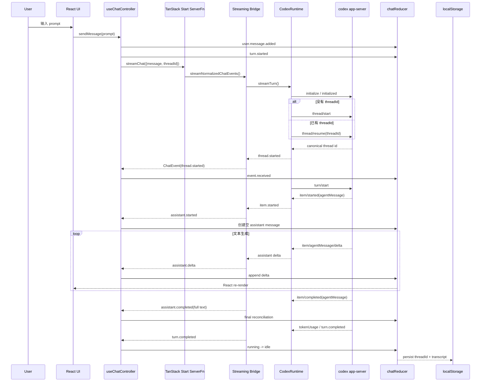
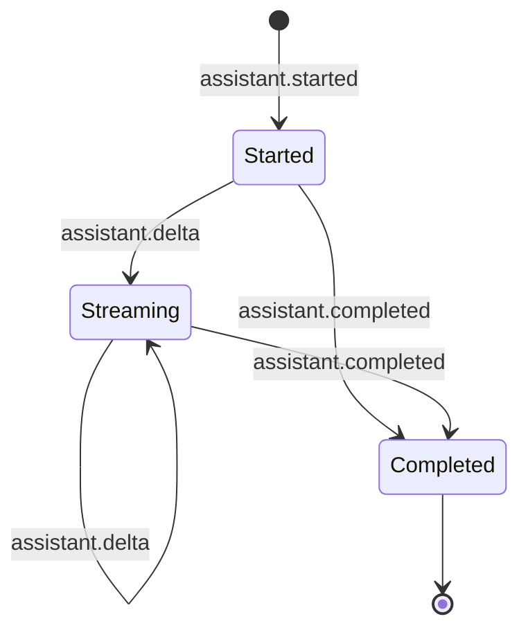
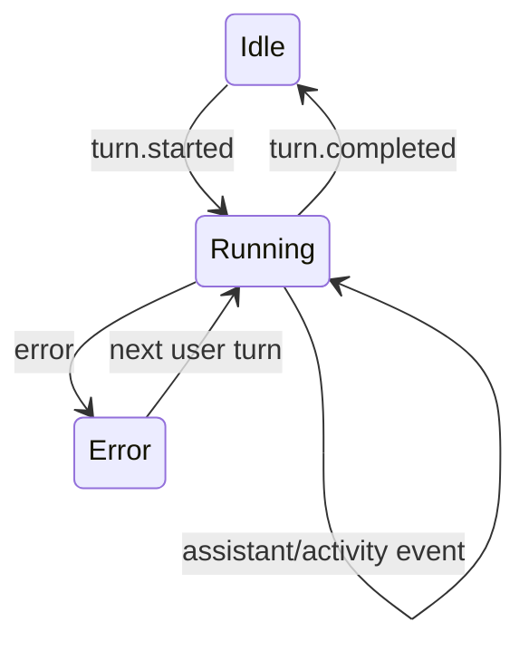

# 端到端总复习：一条用户消息如何穿过整个 Agent 系统

> 这篇不是第五个孤立专题，而是对前四篇的收口。目标是回答一个工程问题：**用户点击发送以后，系统到底发生了什么；每一层为什么存在；哪里最容易出错；哪些模式值得迁移到别的 Agent 产品。**

---

## 1. 先看全链路



这条链路可以压缩成一句话：

```text
用户意图
→ Server RPC
→ Provider Protocol
→ Application Event
→ State Event
→ Deterministic State
→ UI Projection
```

真正稳定的地方不是“Codex 能生成文本”，而是每一次跨边界都发生了**协议收敛**。

---

## 2. 第一阶段：React 不直接“请求答案”，而是启动一个 Turn

`useChatController()` 发送消息时首先做两件本地状态变化：

```text
user.message.added
turn.started
```

这样 UI 不需要等待网络：用户消息立即出现，输入区进入 running 状态。

传统聊天应用容易写成：

```ts
const answer = await request(prompt)
setMessages([...messages, answer])
```

Agent 应用更适合：

```text
start turn
consume events
fold events into state
```

因为一个 turn 期间不仅有文本，还可能有 reasoning activity、command、MCP、file change、usage、interrupt 和 error。

### 可迁移原则

> **Agent UI 的最小单位应该是“Turn 生命周期”，而不是“HTTP response”。**

---

## 3. 第二阶段：`createServerFn` 是信任边界，不只是调用语法糖

浏览器调用：

```text
streamChat({ message, threadId })
```

看起来像本地函数，实际跨越 Browser → Server。

这层至少负责三件事：

1. 输入验证；
2. 隐藏 Node-only Runtime；
3. 把 async generator 作为流返回。

关键模块边界：

```text
src/server-functions/chat.ts
    浏览器可 import 的 RPC declaration

src/server-functions/chat.runtime.server.ts
    server-only integration seam

src/server/codex/**
    Node child process / protocol / auth boundary
```

### 为什么不能直接 import Runtime？

因为浏览器不应该理解：

```text
child_process
stdio
~/.codex
local workspace path
approval request
raw Codex notification
```

### 可迁移原则

> **全栈 TypeScript 的“同语言”不代表“同信任域”。模块边界必须按运行环境和安全责任划分。**

---

## 4. 第三阶段：Runtime 先建立 Codex 会话，再启动 Turn

Runtime 与 `codex app-server --stdio` 通信。

最小生命周期：

```text
spawn
  ↓
initialize
  ↓
initialized
  ↓
thread/start OR thread/resume
  ↓
turn/start
  ↓
notifications
  ↓
turn/completed / failed
  ↓
close
```

### Thread

长期对话上下文。

```text
Thread
├── Turn 1
├── Turn 2
└── Turn 3
```

浏览器只持久化 `threadId`，用它在后续请求中 resume。

### Turn

一次用户请求对应的一整轮 Agent 工作。

### Item

Turn 内部工作单元：

```text
reasoning
commandExecution
mcpToolCall
fileChange
agentMessage
...
```

### 最重要的纠正

```text
Thread ≠ Message[]
Turn ≠ Assistant Message
Item ≠ Token
```

如果这三个概念混淆，后续做 interrupt、tool timeline、多 Agent、thread history 时一定会返工。

---

## 5. 第四阶段：真流式来自 Provider 的 Delta，不来自前端动画

实际关键事件：

```text
item/started(agentMessage)
item/agentMessage/delta × N
item/completed(agentMessage)
```

映射为应用协议：

```text
assistant.started
assistant.delta
assistant.completed
```

### 为什么不是“打字机动画”？

伪流式：

```text
服务端先拿到完整文本
→ 前端 setInterval 一字一字显示
```

真实流式：

```text
模型产生 delta
→ Runtime 立即收到
→ ServerFn 立即 yield
→ Browser 立即 dispatch
→ React 立即 render
```

两者用户观感可能相似，但工程语义完全不同。真正 delta streaming 会改善首字延迟，也允许同步展示工具执行和中断状态。

---

## 6. 第五阶段：为什么需要 `ChatEvent`

Codex 的原始通知不应该直接进入 React：

```text
item/agentMessage/delta
thread/tokenUsage/updated
turn/completed
...
```

应用先收敛成：

```text
ChatEvent
```

例如：

```text
assistant.started
assistant.delta
assistant.completed
activity.started
activity.updated
activity.completed
turn.completed
error
```

### `ChatEvent` 同时承担三种职责

**协议防腐层**：UI 不绑定 Codex。

**安全白名单**：raw reasoning、stdout/stderr、MCP payload 不越界。

**产品语言**：UI 看见的是“Assistant 开始/增量/完成”，而不是 Provider 的 item 类型。

### 如果未来换 Provider

```text
Codex ─┐
Claude ├─ Runtime Adapter ─> ChatEvent ─> UI
Pi    ─┤
Qwen  ─┘
```

产品层不需要跟着底层协议重写。

### 可迁移原则

> **第三方协议应该在服务端边界被翻译成 application-owned contract。**

---

## 7. 第六阶段：Transport Event 还不是 Reducer Event

Browser 收到 `ChatEvent` 后，还经过：

```text
toChatStateEvent()
```

原因是网络协议与状态协议关注点不同。

例如：

```text
assistant.started(id)
```

传输层只需要 id。

而状态层可能需要：

```text
assistant.started(id, createdAt)
```

因此：

```text
Provider Event
  ↓
Runtime Event
  ↓
ChatEvent            transport semantics
  ↓ adapter
ChatStateEvent       state semantics
  ↓ reducer
ChatState            product projection
```

这不是“层太多”，而是每层拥有不同责任。

---

## 8. 第七阶段：Reducer 是事件折叠器

Assistant 的状态机：



Turn 状态机：



### Delta 是增量

```text
old content + event.delta
```

### Completed 是最终权威快照

```text
content = event.text
```

这形成一个非常有价值的可靠性模式：

```text
incremental optimistic projection
+
authoritative final reconciliation
```

中间流负责体验，最终 snapshot 负责正确性。

---

## 9. Reducer purity：为什么时间不能偷偷在 reducer 里生成

理想 reducer：

```text
(state, event) -> nextState
```

相同输入必须有相同输出。

不能在内部调用：

```text
Date.now()
Math.random()
localStorage
network
```

否则会破坏：

- 可重复测试；
- event replay；
- time-travel debugging；
- 并发渲染下的可预测性。

当前代码中的 `Date.now()` fallback 是值得继续修正的工程缺口。正确方向是 controller/adapter 在 reducer 外注入时间。

### 可迁移原则

> **Controller 管副作用，Reducer 管确定性状态转换。**

---

## 10. Persistence：UI Transcript 与 Agent Context 是两套真相

浏览器当前保存：

```text
threadId
messages
```

Codex 自己保存：

```text
thread/session context
```

因此：

```text
Browser transcript ≠ Agent context source of truth
```

浏览器 transcript 是产品投影，Codex thread 是执行上下文。

### 刷新页面

```text
localStorage restore messages
threadId restore
下一条消息 thread/resume(threadId)
```

### New Chat

应该理解为：

```text
clear current UI conversation pointer
```

而不是：

```text
delete Codex historical thread
```

这种边界使 UI 生命周期与 Agent 历史生命周期解耦。

---

## 11. Stale Stream：`generationRef` 解决了什么，没有解决什么

用户在旧请求还没完全结束时 New Chat：

```text
Old Turn -> late event -> New Conversation
```

如果不防护，旧 delta 会写入新页面。

当前 generation guard：

```text
send 时记录 generation
New Chat -> generation++
旧 stream 收到事件 -> generation 不匹配 -> ignore
```

它解决的是：

```text
stale UI write
```

但没有解决：

```text
后台 turn 继续生成
后台 token 继续消耗
child process 继续运行
```

因此：

```text
generation guard ≠ cancellation
```

下一阶段应该增加真正的 `turn/interrupt` 或 signal propagation。

---

## 12. Correlation：为什么长期必须使用 `threadId + turnId`

一个 long-lived app-server 连接上可能同时存在多个 Thread / Turn。

只判断：

```text
message.method === turn/completed
```

长期不够。

应建立：

```ts
ActiveTurn {
  threadId
  turnId
}
```

并过滤：

```text
notification.threadId == active.threadId
notification.turnId == active.turnId
```

否则会出现：

```text
Turn B 的 completed
误结束 Turn A 的 stream
```

当前 process-per-turn 架构降低了这个风险，但没有从协议语义上消除它。

### 可迁移原则

> **在异步事件系统里，合法事件不代表属于当前操作。必须显式 correlation。**

---

## 13. Safety：权限控制和数据泄漏是两个问题

当前 V0 安全策略：

```text
sandbox: read-only
sandboxPolicy.networkAccess: false
approvalPolicy: never
```

这限制 Agent 能做什么。

但还需要另一条独立防线：限制 Browser 能看到什么。

不应该进入浏览器：

```text
raw reasoning
command stdout/stderr
MCP arguments/results
auth material
arbitrary local paths
raw Provider events
```

所以：

```text
Execution permission boundary
!=
Data exposure boundary
```

即使 Agent 是 read-only，也仍可能读取敏感文件路径或输出，因此 normalizer 仍然必须做字段白名单和错误收敛。

---

## 14. Process Lifecycle：V0 与长期形态的 trade-off

当前偏向：

```text
1 turn
→ spawn app-server
→ initialize
→ execute
→ close
```

### 优点

- 隔离简单；
- cleanup 清晰；
- 一个进程只服务一轮，事件串线风险较低；
- Demo 容易验证。

### 缺点

- 每轮重复启动和握手；
- interrupt / steer 较难；
- 多线程复用差；
- 不适合复杂 approval / MCP 生命周期。

长期更合理：

```text
Application
  ↓
long-lived AppServerClient
  ├── Thread A / Turn 1
  ├── Thread A / Turn 2
  └── Thread B / Turn 1
```

这时必须升级：

```text
single reader loop
pending request map
notification subscribers
thread/turn correlation
interrupt
server request routing
bounded shutdown
```

---

## 15. 错误路径应该怎么走

正常链路很容易理解，真正决定系统质量的是异常链路。

典型故障：

```text
codex binary 不存在
initialize RPC error
thread resume 失败
turn failed
child process crash
stdout 非法 JSON
stderr 爆量
stream disconnect
用户 New Chat
network/browser disconnect
```

推荐错误边界：

```text
Raw Runtime Error
  ↓ server log / diagnostics
normalizeCodexRuntimeError
  ↓
Sanitized application error
  ↓
ChatEvent.error
  ↓
Reducer status=error
  ↓
Browser generic message
```

不要把“方便调试”作为把任意 server error 直接发给 Browser 的理由。开发日志与产品错误是两个输出通道。

---

## 16. 调试一条不流式的消息

不要直接猜 React。沿链路逐层定位。

### 第 1 层：Provider 是否产生 delta？

检查真实 App Server 序列：

```text
item/started(agentMessage)
item/agentMessage/delta
item/completed(agentMessage)
```

没有 delta，前端不可能真流式。

### 第 2 层：Runtime 是否保留 delta？

确认 `item/agentMessage/delta` 被转换成内部 delta event。

### 第 3 层：Normalizer 是否过滤掉？

确认产生：

```text
assistant.delta
```

### 第 4 层：ServerFn 是否逐事件 yield？

不能先收集数组再返回。

### 第 5 层：Browser 是否 `for await` 即时 dispatch？

### 第 6 层：Reducer 是否 append 而不是覆盖？

### 第 7 层：UI 是否真的根据 messages render？

这套排查顺序适用于几乎所有流式 Agent UI。

---

## 17. 测试应该沿同一条链路分层

```text
Unit
  - validation
  - normalizer
  - reducer
  - storage

Integration
  - fake app-server
  - request/response id
  - notification buffering
  - turn correlation
  - process exit / abort

Smoke
  - real codex app-server
  - real auth
  - real delta sequence

E2E
  - user send
  - streaming render
  - refresh resume
  - New Chat stale-stream isolation
```

一个常见错误是用很多 reducer unit test 代替 Runtime integration test。测试总数不是覆盖面的替代品。

---

## 18. 这套项目最值得迁移的 8 个模式

1. **Runtime Adapter**：Provider 协议封装在服务端。
2. **Application-owned Event Contract**：UI 不消费第三方事件。
3. **Streaming Async Iterator**：全链路不聚合事件。
4. **Started / Delta / Completed Lifecycle**：把流式内容作为实体生命周期建模。
5. **Final Reconciliation**：最终 snapshot 校准增量状态。
6. **Transport Event / State Event 分层**：网络语义与状态语义解耦。
7. **Generation Guard + 真 Cancellation 分治**：一个保护 UI，一个停止资源。
8. **Permission Boundary + Data Boundary 双防线**：能做什么与能看到什么分别控制。

这八个模式比任何单一 Codex API 更有长期价值。

---

## 19. 什么时候应该换技术方案？

### TanStack ServerFn vs SSE

当前 ServerFn async generator 类型整合简单。如果未来需要跨非 TanStack 客户端、独立 API 网关或标准化 HTTP stream，可考虑 SSE。

### SSE vs WebSocket

只需要 Server → Client 连续事件：SSE 足够。

需要真正双向实时控制：

```text
interrupt
steer
approval
实时 tool interaction
```

WebSocket 或长连接协议会更自然。

### process-per-turn vs long-lived App Server

Demo/单用户/隔离优先：process-per-turn 简单。

桌面 Agent/多会话/interrupt/steer：long-lived client 更合理。

不要为了“更先进”过早复杂化；技术切换应该由交互需求和生命周期要求驱动。

---

## 20. 最终复习题

1. 为什么 `runStreamed()` 有事件不代表一定支持 Assistant 正文真流式？
2. Thread、Turn、Item 分别是谁的生命周期？
3. 为什么 `ChatEvent` 是安全边界，而不仅是类型定义？
4. 为什么还要从 `ChatEvent` 转成 `ChatStateEvent`？
5. `assistant.completed` 已有完整文本，为什么前面还要处理 delta？
6. 为什么 reducer 内的 `Date.now()` 是工程问题？
7. `generationRef` 为什么不能替代 `turn/interrupt`？
8. 为什么 `threadId` 不能完全替代 `turnId` correlation？
9. read-only sandbox 能否保证浏览器不会看到敏感路径？为什么？
10. 如果改成长连接 App Server，`AppServerConnection` 最需要增加哪些基础设施？
11. 为什么 Browser transcript 不能作为 Agent context 的唯一 source of truth？
12. 一个真实 Agent Runtime 的 integration test 应该模拟哪些消息乱序和故障？

如果能脱离源码准确回答这 12 个问题，就已经掌握了这套项目真正有迁移价值的架构知识。

---

## 21. 一页总结

```text
Browser
只拥有产品状态
    ↓
TanStack Start
建立可信 Server boundary
    ↓
ChatEvent
建立应用自己的协议
    ↓
CodexRuntime
隔离 Provider / process / auth
    ↓
codex app-server
产生 thread / turn / item / delta
```

返回方向：

```text
Provider notification
→ Runtime normalization
→ ChatEvent
→ ChatStateEvent
→ reducer
→ UI projection
→ local persistence
```

可靠性补充：

```text
correlation
cancellation
process cleanup
final reconciliation
error sanitization
fake transport tests
```

安全补充：

```text
read-only / no network / no approval
+
Browser event whitelist
```

最终原则：

> **不要让 UI 理解 Runtime，不要让第三方协议定义产品状态，不要让流式体验牺牲最终一致性，也不要把“能运行”误认为“生命周期已经正确”。**
